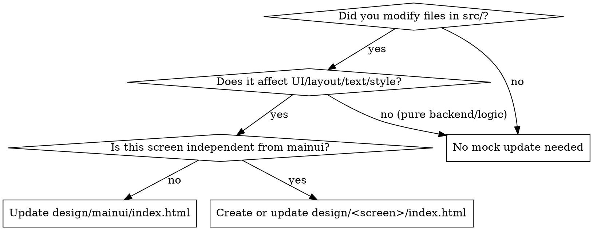

# Syncing UI Mocks (Tauri画面変更のモック同期)

## Overview

**Core Principle:** Tauri の画面実装（`src/` 配下）と対応するデザインプロトタイプは常に 1:1 で同期する。

メイン画面に属する UI は `design/mainui/index.html` に反映する。メイン画面から独立して表示される画面は、画面ごとに `design/<画面名>/index.html` を作成または更新する。

独立画面のプロトタイプは、その `index.html` を直接開くだけで画面と操作を確認できるようにする。メイン画面から開く導線を変更した場合は、メイン画面のプロトタイプも同期する。


## The Iron Law

```
NO TAURI UI CHANGE IS COMPLETE WITHOUT UPDATING ITS CORRESPONDING DESIGN/<SCREEN>/INDEX.HTML
(メイン画面は design/mainui/index.html、独立画面は design/<画面名>/index.html)
```

**Violating the letter of this rule is violating the spirit of this rule.**
「本番コードは動いている」「テストが通った」「単なるモックだから後回しでよい」という理由は一切認められません。

---

## When to Use



### Apply When:

- `src/App.tsx` の配置やレイアウト構成を変更した
- `src/components/**` 配下の UI コンポーネントを追加・修正・削除した
- `src/constants/index.ts` の UI 文言定数（`UI_MESSAGES`）や寸法（`LAYOUT_CONSTANTS`）を変更した
- `src/types/search.ts` で検索条件（`SearchQuery`）や結果データ型（`SearchMatch`）に画面表示用フィールドを追加した
- 検索オプション、ボタン、入力欄、アイコン、バッジ、色調、ツールチップ、トースト通知の内容が変更された
- メイン画面とは別のウィンドウやルートとして表示できる画面を追加・変更した

### Do NOT Apply When:

- `src-tauri/**` のみの変更で、画面の見た目や操作に一切影響がない内部ロジック改修
- ドキュメント（Markdown）、CI 設定、またはパッケージ依存関係の軽微な更新

---

## Prototype Destination (更新先の決定)

- メイン画面内のペイン、モーダル、ポップオーバーは `design/mainui/index.html` に同期する。
- メイン画面から独立したウィンドウやルートは、画面名を小文字の kebab-case にして `design/<画面名>/index.html` に同期する。ディレクトリがなければ作成する。
- 独立画面の `index.html` は、メイン画面の DOM、状態、JavaScript、Tauri 実行環境に依存させない。必要なマークアップ、モックデータ、操作用 JavaScript をその画面内に用意し、`file://` または静的サーバーで直接開けるようにする。
- 同じ変更がメイン画面の起動ボタンや画面遷移にも及ぶ場合は、`design/mainui/index.html` も更新する。

---

## Component-to-Mock Mapping Reference

`src/` 内の React コンポーネントと `design/mainui/index.html` の対応箇所：


| React コンポーネント (`src/`)    | モック HTML 内の領域 / 要素                                                                                                                            | 主な構成要素と同期ポイント                                                                                                                      |
| ------------------------- | --------------------------------------------------------------------------------------------------------------------------------------------- | ---------------------------------------------------------------------------------------------------------------------------------- |
| **`WindowFrame.tsx`**     | 最上位レイアウト `[[ORCA_RICH_MD:e72a40e32404176252f270254aa59128:inline-html:%3Cdiv%20class%3D%22bg-%5B%23121214%5D%20...%22%3E]]`                   | OSネイティブウィンドウ装飾に準拠（Webview内の独自タイトルバーは廃止）。全画面フレックス配置。                                                                                |
| **`SearchBar.tsx`**       | 最上部 `[[ORCA_RICH_MD:e72a40e32404176252f270254aa59128:inline-html:%3Cheader%20class%3D%22bg-%5B%2318181b%5D%20...%22%3E]]`                     | キーワード入力、クリアボタン、フォルダDnDドロップゾーン（バウンスアニメーション・点線オーバーレイ）、SEARCH/CANCELボタン、オプションピル（大文字小文字、正規表現、数式、コメント、非表示シート）、対象拡張子。                    |
| **`ResultTable.tsx`**     | 左ペイン (58%) `[[ORCA_RICH_MD:e72a40e32404176252f270254aa59128:inline-html:%3Cdiv%20class%3D%22w-%5B58%25%5D%20...%22%3E]]`                      | テーブルヘッダー、列見出し（ファイル名、シート、セル、一致種別、一致内容）、ソート矢印、結果内絞り込みフィルタ、一致種別バッジ（「値」「数式」「メモ」「非表示」）、仮想スクロール行シミュレーション。                                |
| **`PreviewHeader.tsx`**   | 右ペイン (42%) 上部 `[[ORCA_RICH_MD:e72a40e32404176252f270254aa59128:inline-html:%3Cdiv%20class%3D%22p-3%20pr-4%20bg-%5B%231c1c1f%5D%20...%22%3E]]` | 1行目: ファイル名、シート名バッジ、**スプリットボタン**（左: 既定アプリ起動、右: サポートアプリ一覧ドロップダウン）、保存フォルダを開くボタン。<br>2行目: 独立ファイルパス表示行、クリップボードコピーボタン（Checkアイコンフィードバック）。 |
| **`FormulaBar.tsx`**      | 数式バー `[[ORCA_RICH_MD:e72a40e32404176252f270254aa59128:inline-html:%3Cdiv%20class%3D%22bg-%5B%23202024%5D%20...%22%3E]]`                       | 名前ボックス（セル番地、例: `A12`）、`fx` 記号、セル内容/数式表示テキスト。                                                                                       |
| **`SpreadsheetGrid.tsx`** | グリッド領域 `[[ORCA_RICH_MD:e72a40e32404176252f270254aa59128:inline-html:%3Cdiv%20class%3D%22flex-1%20p-3.5%20...%22%3E]]`                         | 周辺セル案内バー、固定見出しテーブル（行番号 `#`、列名 `A, B, C...`）、一致セルハイライト、クリックによる選択セル移動と数式バー連動。                                                        |
| **`SheetTabs.tsx`**       | シートタブバー `[[ORCA_RICH_MD:e72a40e32404176252f270254aa59128:inline-html:%3Cdiv%20id%3D%22sheetTabsWrapper%22%20...%22%3E]]`                      | ブック内ワークシート一覧タブ、アクティブシート下線ハイライト、左右スクロールボタン。                                                                                         |
| **`MetaInfoCard.tsx`**    | メタ情報カード `[[ORCA_RICH_MD:e72a40e32404176252f270254aa59128:inline-html:%3Cdiv%20id%3D%22metaInfoWrapper%22%20...%22%3E]]`                       | 一致種別詳細、生テキスト全文、行番号、列番号/列名、非表示シートステータス。                                                                                             |
| **`StatusBar.tsx`**       | 最下部フッター `[[ORCA_RICH_MD:e72a40e32404176252f270254aa59128:inline-html:%3Cfooter%20class%3D%22h-10%20...%22%3E]]`                               | 状態インジケーター（点滅/点灯）、**プログレスバー（メッセージ前に固定幅 w-44 で配置）**、ステータステキスト（フォルダスキャン中/ファイル解析中/完了）、Calamine Engineバッジ＆バージョン、CSV/Excel出力ボタン。         |
| **`Toast.tsx`**           | トースト `[[ORCA_RICH_MD:e72a40e32404176252f270254aa59128:inline-html:%3Cdiv%20id%3D%22toast%22%20...%22%3E]]`                                    | 右下フローティング通知、アニメーション、自動フェードアウト（3秒）、閉じるボタン。                                                                                          |


---

## Core Simulation Rules (スタンドアローン動作の原則)

各 `design/<画面名>/index.html` はブラウザ単体（`file://` や静的サーバー）で誰でも即座に確認できるスタンドアローンファイルでなければなりません。`mainui` もこの規則に含みます。

1. **ゼロ・バックエンド依存 (No Tauri Runtime Required)**
   - `@tauri-apps/api` や IPC 呼び出しを直書きしてはならない。
   - すべての IPC コール（`invoke`, `open`, `save`, `clipboard`）は、JavaScript のモックロジックとトースト通知でシミュレートする。
2. **CDN 依存の維持**
   - Tailwind CSS: `[[ORCA_RICH_MD:e72a40e32404176252f270254aa59128:inline-html:%3Cscript%20src%3D%22https%3A%2F%2Fcdn.tailwindcss.com%22%3E]][[ORCA_RICH_MD:e72a40e32404176252f270254aa59128:inline-html:%3C%2Fscript%3E]]`
   - Lucide Icons: `[[ORCA_RICH_MD:e72a40e32404176252f270254aa59128:inline-html:%3Cscript%20src%3D%22https%3A%2F%2Funpkg.com%2Flucide%40latest%22%3E]][[ORCA_RICH_MD:e72a40e32404176252f270254aa59128:inline-html:%3C%2Fscript%3E]]`
   - アイコン追加時は `data-lucide="icon-name"` を使用し、動的レンダリング後に `lucide.createIcons()` を呼び出す。
3. **インタラクティブ整合性の維持**
   - 検索結果テーブルの行をクリックした際、プレビューヘッダー、数式バー、グリッド、シートタブ、メタ情報カードのすべてが連動して更新されること。
   - スプレッドシート内のセルをクリックした際、名前ボックスと数式バーがそのセルの値に切り替わること。
   - ドロップダウンメニュー（スプリットボタン等）は外側クリックや Esc キーで正しく閉じること。
4. **憲章原則の遵守**
   - 原則I: 自然かつ正確な日本語文言（`src/constants/index.ts` の定数文言と完全一致させる）。
   - 原則III: ファイル冒頭に目的、構成要素、エラー条件、変更履歴を網羅した 4 要素ヘッダコメントを記載する。

---

## Step-by-Step Synchronization Workflow

```
1. 差分の特定:
   git status --short -- src/
   新規ファイルを含め、変更されたコンポーネント・定数・スタイルを洗い出す。

2. 更新先の決定と HTML マークアップの反映:
   メイン画面内なら design/mainui/index.html、独立画面なら
   design/<画面名>/index.html を選ぶ。独立画面のディレクトリがなければ作成する。
   React JSX と同じ Tailwind クラス・DOM 構造・アイコン・ID を反映する。

3. モックデータ & イベントリスナーの更新:
   対応する画面に必要なモックデータとイベントハンドラを追加・更新する。

4. 構文 & 動作検証:
   更新した各 index.html を HTML パーサーで確認する。
   ブラウザで各ファイルを直接開き、メイン画面なしで表示されることと、クリックやトグルが破綻していないことを確認する。

5. 憲章コメント更新:
   変更履歴（バージョン、日付、改修内容）をヘッダコメントに記録する。
```

---

## Rationalization Table (言い訳の完全封殺)


| よくある言い訳・思い込み                            | 現実と対処ルール                                                                    |
| --------------------------------------- | --------------------------------------------------------------------------- |
| 「今回は小さな UI 修正だからモック更新は不要」               | 小さな変更の蓄積がモックの腐敗を招く。1行のラベル変更であっても即時反映すること。                                   |
| 「`npm run build` が通ったのでタスク完了である」        | ビルド通過は TypeScript の整合性を示しているに過ぎない。デザイン同期チェックを通過するまで完了ではない。                  |
| 「デザインモックは最初のプロトタイプだから最新仕様とズレていても構わない」   | 各 `design/<画面名>/index.html` は生きた仕様（Living Spec）として扱われる。乖離はバグである。 |
| 「独立画面も mainui に含めればよい」 | 独立画面は `design/<画面名>/index.html` を作成または更新し、単独で開けるようにする。 |
| 「Tauri ネイティブのダイアログや IPC は HTML で再現できない」 | 動作をスキップするのではなく、トースト通知（`showToast`）による自然なシミュレーションを実装すること。                    |
| 「HTML ファイルを手動で直すのは面倒」                   | 画面設計の確認やレビューにおいて、スタンドアローン HTML は最速のフィードバック手段である。省略は許されない。                   |


---

## Red Flags - STOP and Sync Immediately

以下の思考や行動が現れたら **作業完了を宣言せず、即座にモック同期を実施すること**：

- `src/components/` の UI 変更に対応する `design/<画面名>/index.html` が `git status` に含まれていない
- 独立画面を `design/mainui/index.html` 内だけで再現している
- 「とりあえずフロントエンドの実装だけ先に PR を出そう」と考えている
- 「モック更新は別のタスクに切り出そう」と先送りしている
- モックの HTML は直したが、JavaScript のモックデータやクリックイベントを更新していない
- `showToast` や `lucide.createIcons()` を呼び忘れてアイコンが消えている

---

## Verification Checklist

画面変更作業の完了宣言前に、以下の検証を必ず実行すること：

- [ ] `git status` を確認し、`src/` の UI 変更に対応する `design/<画面名>/index.html` が変更対象に含まれていること（メイン画面は `design/mainui/index.html`）
- [ ] 独立画面の新設時には `design/<画面名>/index.html` が存在し、そのファイルだけを直接開いて画面と操作を確認できること
- [ ] 更新した各 `index.html` に HTML 構文エラーがないこと
- [ ] アイコン名が正しい Lucide アイコン名になっており、動的変更時に `lucide.createIcons()` が実行されること
- [ ] 新機能・新オプションがブラウザ上でクリック可能で、トーストや状態変化のフィードバックがあること
- [ ] ヘッダコメントに変更履歴（日付、バージョン、変更内容）が記載されていること
