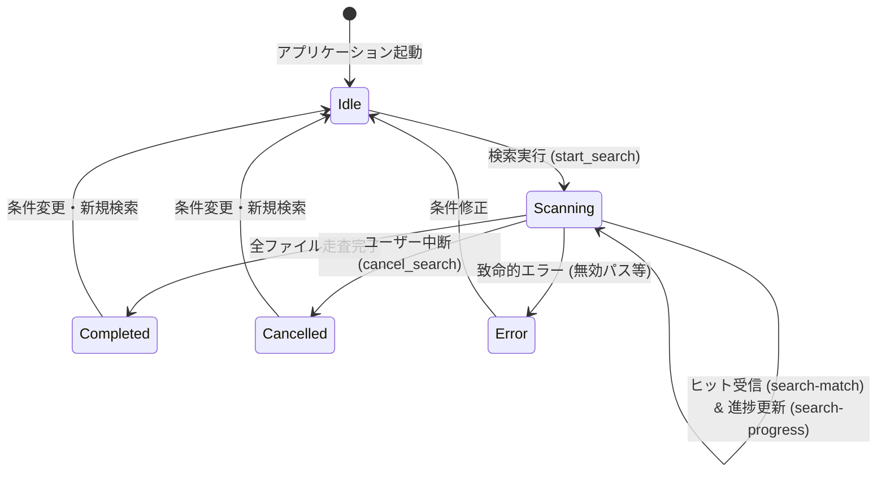

# データモデル設計: Excel Grep デスクトップアプリケーション (Data Model)

**機能ブランチ**: `001-excel-grep-app`  
**日付**: 2026-09-25  
**仕様書**: [spec.md](./spec.md) | **技術調査**: [research.md](./research.md)

---

## 概要

本ドキュメントは、Excel Grep アプリケーションの Rust バックエンドおよび TypeScript フロントエンド間でやり取りされるデータ構造（エンティティ、状態、バリデーションルール、IPC ペイロード）を定義します。

---

## 主要エンティティ定義

### 1. SearchQuery (検索リクエスト)

ユーザーが入力した検索条件を表すエンティティ。

| フィールド名 | 型 (Rust / TS) | 必須 | デフォルト値 | 説明 |
|:---|:---|:---:|:---|:---|
| `keyword` | `String` / `string` | Yes | - | 検索文字列または正規表現パターン |
| `target_dir` | `String` / `string` | Yes | - | 走査対象のフォルダ絶対パス |
| `match_case` | `bool` / `boolean` | No | `false` | 大文字/小文字の区別トグル |
| `use_regex` | `bool` / `boolean` | No | `false` | 正規表現マッチング有効化トグル |
| `include_formula` | `bool` / `boolean` | No | `true` | セル内の数式文字列を検索対象に含めるか |
| `include_comment` | `bool` / `boolean` | No | `true` | セルのコメント・メモを検索対象に含めるか |
| `include_hidden` | `bool` / `boolean` | No | `false` | 非表示シート・非表示セルを検索対象に含めるか |
| `extensions` | `Vec<String>` / `string[]` | No | `[".xlsx", ".xlsm", ".xlsb", ".xls"]` | 対象ファイル拡張子リスト |

**バリデーションルール**:
- `keyword` はトリム後 1 文字以上であること（空文字での検索は不可）。
- `use_regex` が `true` の場合、`keyword` は有効な Rust `regex::Regex` 構文であること（無効時は検索前にエラー返却）。
- `target_dir` はローカルファイルシステム上に実在するディレクトリパスであること。

---

### 2. SearchMatch (検索一致アイテム)

検索条件に一致したセルまたはシート要素を表すエンティティ。左ペインの結果テーブル一覧に表示される。

| フィールド名 | 型 (Rust / TS) | 説明 |
|:---|:---|:---|
| `id` | `u64` / `number` | フロントエンドでの一意な連番識別子 |
| `file_name` | `String` / `string` | ファイル名（例: `Q3_Summary.xlsx`） |
| `full_path` | `String` / `string` | ファイルの絶対パス（例: `C:\Reports\Q3_Summary.xlsx`） |
| `sheet_name` | `String` / `string` | ワークシート名（例: `Data`） |
| `cell_address` | `String` / `string` | セル番地（例: `A12`, `B13`） |
| `row_index` | `u32` / `number` | 行番号（1始まり） |
| `col_index` | `u32` / `number` | 列番号（1始まり） |
| `col_name` | `String` / `string` | 列記号（例: `A`, `B`, `AA`） |
| `match_type` | `MatchType` (Enum) | 一致種別 (`CellValue`, `Formula`, `Comment`, `HiddenSheet`) |
| `snippet` | `String` / `string` | 一致箇所の前後を含む抜粋テキスト（UI用マークアップ `<mark>` 付与） |
| `full_content` | `String` / `string` | セルの完全な文字列値 |
| `formula` | `Option<String>` / `string \| null` | 数式文字列（数式が存在する場合のみ） |
| `sheets_in_workbook` | `Vec<String>` / `string[]` | ブック内に存在する全シート名の一覧（タブ表示用） |

---

### 3. MatchType (一致種別 Enum)

| 列挙値 (Rust) | TS 表現 | 説明 | バッジスタイル (プロトタイプ準拠) |
|:---|:---|:---|:---|
| `CellValue` | `"CellValue"` | セルの表示テキスト値に一致 | 青系 (`bg-blue-950 text-blue-300`) |
| `Formula` | `"Formula"` | 計算式（数式）文字列に一致 | 紫系 (`bg-purple-950 text-purple-300`) |
| `Comment` | `"Comment"` | コメントまたはメモに一致 | 琥珀系 (`bg-amber-950 text-amber-300`) |
| `HiddenSheet`| `"HiddenSheet"`| 非表示シート内のセルに一致 | 赤系 (`bg-rose-950 text-rose-300`) |

---

### 4. CellPreviewData (周辺セルプレビュー情報)

右ペインのワークシートグリッドに表示するための、該当セル周辺の局所マトリクスデータ。

| フィールド名 | 型 (Rust / TS) | 説明 |
|:---|:---|:---|
| `target_row` | `u32` / `number` | 一致したターゲットセルの行番号 |
| `target_col` | `u32` / `number` | 一致したターゲットセルの列番号 |
| `columns` | `Vec<PreviewColumn>` | 表示対象列ヘッダー一覧（例: `[{key: "col_a", label: "A"}, ...]`） |
| `rows` | `Vec<PreviewRow>` | 表示対象行データ（行番号 + 各列のセル値マップ） |

#### PreviewRow

```typescript
interface PreviewRow {
  row_number: number;                   // 行番号 (例: 12)
  cells: Record<string, CellValueInfo>; // 列キー (例: "A") -> セル値詳細
}

interface CellValueInfo {
  value: string;                        // 表示文字列
  is_target: boolean;                   // 検索一致ターゲットセルか否か
  formula?: string;                     // 数式文字列
}
```

---

### 5. ScanProgress (スキャン進捗情報)

検索実行中にバックグラウンドから随時ストリーミング配信される進捗イベントペイロード。

| フィールド名 | 型 (Rust / TS) | 説明 |
|:---|:---|:---|
| `state` | `ScanState` (Enum) | `Scanning`, `Completed`, `Cancelled`, `Error` |
| `scanned_files` | `usize` / `number` | 走査完了したファイル数 |
| `total_files` | `usize` / `number` | 対象拡張子を持つ総ファイル数（概算） |
| `matches_found` | `usize` / `number` | これまでに検出された累積ヒット件数 |
| `current_file` | `String` / `string` | 現在スキャン中のファイル名 |
| `elapsed_ms` | `u64` / `number` | 検索開始からの経過時間（ミリ秒） |

---

### 6. ExportRequest & ExportResult (エクスポート)

| フィールド名 | 型 (Rust / TS) | 説明 |
|:---|:---|:---|
| `format` | `ExportFormat` (Enum) | `Csv` または `Xlsx` |
| `output_path` | `String` / `string` | 出力先ファイルの絶対パス |
| `items` | `Vec<SearchMatch>` | エクスポート対象の一致リスト |

---

## ライフサイクルと状態遷移 (State Transitions)



1. **Idle**: 待機状態。「SEARCH」ボタンがアクティブ。
2. **Scanning**: 検索中状態。「SEARCH」ボタンが「CANCEL」ボタン（スピナー付き）に変化。プログレスバーが稼働し、検出された `SearchMatch` が仮想スクロールテーブルに順次ストリーミング追記される。
3. **Completed / Cancelled**: 走査完了またはユーザーによる中断。最終的な件数と所要時間がステータスバーに表示され、結果の保持・プレビュー閲覧・エクスポートが可能。
