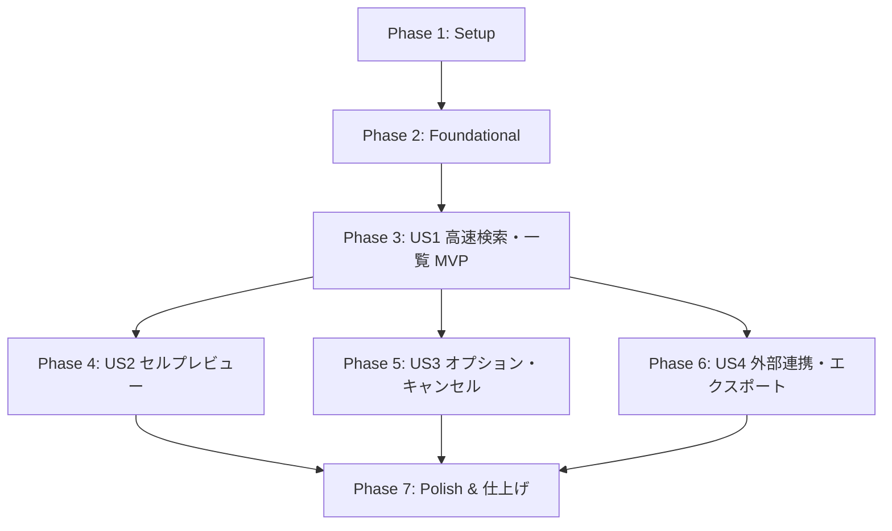

# タスク分解一覧: Excel Grep デスクトップアプリケーション (Implementation Tasks)

**機能ブランチ**: `001-excel-grep-app`  
**日付**: 2026-09-25  
**仕様書**: [spec.md](./spec.md) | **実装計画書**: [plan.md](./plan.md) | **データモデル**: [data-model.md](./data-model.md) | **API契約**: [tauri-ipc-api.json](./contracts/tauri-ipc-api.json)

---

## 概要

本ドキュメントは、Excel Grep デスクトップアプリケーション（Tauri v2 + Rust + React + Tailwind CSS）の実装タスクをユーザーストーリー単位で分解した実行可能なチェックリストです。各タスクは独立して実装・テスト可能な粒度に設計されています。

---

## Phase 1: Setup (プロジェクト初期化・環境構築)

**目的**: Tauri v2, React, TypeScript, Tailwind CSS, Rust クレートの初期構成と基盤構築

- [X] T001 Tauri v2 + React + TypeScript プロジェクト基盤の初期構成 (`package.json`, `src-tauri/Cargo.toml`, `src-tauri/tauri.conf.json`)
- [X] T002 [P] Tailwind CSS、PostCSS、Lucide Icons のセットアップ (`tailwind.config.js`, `postcss.config.js`, `src/index.css`)
- [X] T003 [P] Rust 側主要依存クレート (`calamine`, `rayon`, `regex`, `walkdir`, `serde`, `serde_json`, `open`, `csv`, `rust_xlsxwriter`) の設定 (`src-tauri/Cargo.toml`)
- [X] T004 [P] テスト用 Excel フィクスチャファイル (.xlsx, .xlsm, .xlsb) の配置 (`tests/fixtures/`)

---

## Phase 2: Foundational (共通基盤・IPC型定義・レイアウトフレーム)

**目的**: 全ユーザーストーリーが依存する共通データ型、IPC コマンド登録構造、基本 2 ペインレイアウトの構築  
**⚠️ CRITICAL**: 本フェーズ完了までユーザーストーリー実装を開始しないこと

- [X] T005 [P] Rust 側共通データモデル・構造体定義の実装 (`src-tauri/src/models/mod.rs` - `SearchQuery`, `SearchMatch`, `MatchType`, `ScanProgress`, `CellPreviewData`)
- [X] T006 [P] TypeScript 側共通インターフェース・型定義の実装 (`src/types/search.ts` - `SearchQuery`, `SearchMatch`, `CellPreviewData`, `ScanProgress`)
- [X] T007 [P] Tauri IPC コマンド登録骨格とプラグイン初期化の実装 (`src-tauri/src/commands/mod.rs`, `src-tauri/src/lib.rs`)
- [X] T008 タイトルバー、左右 2 ペイン分割、フッターからなるメイン画面レイアウトフレームの実装 (`src/components/layout/WindowFrame.tsx`, `src/App.tsx`)

**チェックポイント**: 共通基盤完了。ユーザーストーリーの実装へ進むことが可能。

---

## Phase 3: User Story 1 - 高速フォルダ横断検索と結果一覧表示 (Priority: P1) 🎯 MVP

**ゴール**: 指定フォルダ配下の Excel ファイルを一括走査し、結果テーブル（仮想スクロール対応）に順次ストリーミング表示する  
**独立テスト基準**: テストフォルダを指定してキーワード検索を実行し、全一致項目がストリーミングで追記され、仮想スクロールにより軽快に一覧閲覧できること

- [X] T009 [P] [US1] `calamine` による Excel ファイル単体走査エンジンの実装 (`src-tauri/src/search/parser.rs` - セル値抽出、部分一致マッチング)
- [X] T010 [P] [US1] `rayon` によるマルチスレッド並列ディレクトリ走査エンジンの実装 (`src-tauri/src/search/engine.rs` - walkdir 連携、ファイル走査スレッドプール)
- [X] T011 [US1] Tauri IPC コマンド `start_search` およびストリーミングイベント発火の実装 (`src-tauri/src/commands/search_cmd.rs` - `search-match`, `search-progress`, `search-complete` イベント)
- [X] T012 [P] [US1] 検索入力バーコンポーネントの実装 (`src/components/search/SearchBar.tsx` - キーワード入力、フォルダ選択、Enter キー検索)
- [X] T013 [P] [US1] 仮想スクロール結果一覧テーブルコンポーネントの実装 (`src/components/results/ResultTable.tsx` - `@tanstack/react-virtual` 統合、ファイル名・シート・セル番地・一致種別・抜粋ハイライト表示)
- [X] T014 [US1] 結果テーブル内インクリメンタル絞り込みフィルタの実装 (`src/components/results/ResultFilter.tsx`, `src/hooks/useSearch.ts`)
- [X] T015 [US1] 検索ステータスメトリクスおよびプログレスバーの実装 (`src/components/common/StatusBar.tsx` - ヒット件数、所要時間表示)
- [X] T016 [US1] US1 各コンポーネントの統合とエンドツーエンド検索動作検証 (`src/App.tsx`)

**チェックポイント**: User Story 1 (MVP) が単独で動作し、フォルダ横断検索と仮想スクロール結果一覧が利用可能。

---

## Phase 4: User Story 2 - セル周辺のスプレッドシートプレビューと詳細確認 (Priority: P2)

**ゴール**: 結果一覧の行クリックに応じて、右ペインに該当ファイルのパス、数式バー、周辺セル（前後3行・前後2列）の固定ヘッダー付きワークシートグリッド、シートタブ、メタカードを即座に表示する  
**独立テスト基準**: 一覧の行を選択した際、100ms 以内に右ペインのプレビューが切り替わり、固定ヘッダー（sticky）でスクロールでき、枠線欠けや文字欠けが発生しないこと

- [X] T017 [P] [US2] 周辺セル局所抽出ロジックの実装 (`src-tauri/src/search/preview.rs` - 前後 3 行・前後 2 列のバウンディングボックス抽出、行番号・列記号マトリクス生成)
- [X] T018 [US2] Tauri IPC コマンド `get_cell_preview` の実装 (`src-tauri/src/commands/preview_cmd.rs`)
- [X] T019 [P] [US2] プレビュー上部ヘッダーコンポーネントの実装 (`src/components/preview/PreviewHeader.tsx` - ファイル名、シート名バッジ、独立した場所パス専用行)
- [X] T020 [P] [US2] Excel 数式バーコンポーネントの実装 (`src/components/preview/FormulaBar.tsx` - セル番地ボックス、fx アイコン、完全なセル値/数式)
- [X] T021 [P] [US2] ワークシートプレビューグリッドの実装 (`src/components/preview/SpreadsheetGrid.tsx` - sticky 固定ヘッダー、対象セル強調枠線＆背景ハイライト、右辺欠け防止マージン)
- [X] T022 [P] [US2] Excel 風シートタブバーの実装 (`src/components/preview/SheetTabs.tsx` - 矢印ナビゲーション、アクティブシート強調表示、ブック内シート一覧)
- [X] T023 [P] [US2] 一致詳細メタ情報カードの実装 (`src/components/preview/MetaInfoCard.tsx` - 一致種別、行番号、列番号、完全テキスト、非表示状態)
- [X] T024 [US2] US2 プレビューペインの統合とセル選択連動動作検証 (`src/components/preview/PreviewPane.tsx`, `src/App.tsx`)

**チェックポイント**: User Story 1 と 2 が連携して動作し、検索結果の選択からプレビュー確認までが快適に完了。

---

## Phase 5: User Story 3 - 検索オプションのカスタマイズ & 検索中断 (CANCEL) 制御 (Priority: P3)

**ゴール**: 大文字/小文字区別、正規表現、数式、コメント、非表示シートの検索トグルを制御し、検索実行中は「CANCEL」ボタンで安全に即時中断できるようにする  
**独立テスト基準**: 各トグルに応じた抽出結果を確認し、大量検索中に CANCEL を押して即座に停止し結果が保持されること

- [X] T025 [P] [US3] `calamine` における数式 (Formula)、コメント、非表示シート (Hidden Sheet) の走査・判定処理の実装 (`src-tauri/src/search/parser.rs`)
- [X] T026 [US3] `AtomicBool` による検索キャンセル制御の実装 (`src-tauri/src/search/engine.rs`, `src-tauri/src/commands/search_cmd.rs` - `cancel_search` コマンド)
- [X] T027 [P] [US3] 検索オプショントグルピル群の実装 (`src/components/search/SearchOptions.tsx` - 大文字小文字、正規表現、数式、コメント、非表示シート、対象拡張子バッジ)
- [X] T028 [US3] SEARCH / CANCEL ボタン状態切り替えと中断ハンドリングの実装 (`src/components/search/SearchButton.tsx`, `src/hooks/useSearch.ts`)
- [X] T029 [US3] US3 各オプション検索および検索中断の動作検証 (`src/App.tsx`)

**チェックポイント**: 柔軟な検索条件指定と、安全な即時中断処理が機能する。

---

## Phase 6: User Story 4 - 外部連携および検索結果のエクスポート (Priority: P4)

**ゴール**: Excel 起動、エクスプローラーでのフォルダ表示、パスのクリップボードコピー、CSV / XLSX エクスポートを提供する  
**独立テスト基準**: 「Excel で開く」「フォルダを開く」「パスをコピー」「CSV エクスポート」「Excel エクスポート」がすべて正常に動作すること

- [X] T030 [P] [US4] Excel アプリケーション起動およびエクスプローラー表示 IPC コマンドの実装 (`src-tauri/src/commands/system_cmd.rs` - `open_in_excel`, `open_in_folder`)
- [X] T031 [P] [US4] CSV (BOM 付き UTF-8) および XLSX エクスポートエンジンの実装 (`src-tauri/src/export/csv_export.rs`, `src-tauri/src/export/xlsx_export.rs`)
- [X] T032 [US4] Tauri IPC コマンド `export_results` の実装 (`src-tauri/src/commands/export_cmd.rs`)
- [X] T033 [P] [US4] パスコピーボタンとトースト通知コンポーネントの実装 (`src/components/common/Toast.tsx`, `src/components/preview/PreviewHeader.tsx`)
- [X] T034 [P] [US4] フッターエクスポートボタン群の実装 (`src/components/common/ExportButtons.tsx`, `src/hooks/useExport.ts`)
- [X] T035 [US4] US4 外部連携およびファイルエクスポートの動作検証 (`src/App.tsx`)

**チェックポイント**: 全ユーザーストーリー (P1 〜 P4) が完全に統合・連携して動作する。

---

## Phase 7: Polish & Cross-Cutting Concerns (仕上げ・品質強化)

**目的**: エラーハンドリングの強化、ショートカット対応、リグレッション防止

- [X] T036 [P] 破損ファイル・アクセス権限エラー発生時のグレースフルスキップと通知処理 (`src-tauri/src/search/engine.rs`, `src/components/common/Toast.tsx`)
- [X] T037 [P] 無効な正規表現入力時のリアルタイムバリデーションとエラー通知 (`src/hooks/useSearch.ts`)
- [X] T038 キーボードショートカットの統合 (`src/App.tsx` - Enter で検索開始、Esc でキャンセル等)
- [X] T039 ウィンドウリサイズ時のレイアウト安定性・欠け防止（幅 1160px 等）の最終スタイル調整 (`src/index.css`)
- [X] T040 [quickstart.md](./quickstart.md) に基づく全 E2E 検証シナリオの実行確認

---

## 依存関係と実行順序 (Dependencies & Execution Order)

### フェーズ依存関係

- **Phase 1 (Setup)**: 依存関係なし。即座に開始可能。
- **Phase 2 (Foundational)**: Phase 1 完了に依存。**全ユーザーストーリー着手前の必須ゲート**。
- **Phase 3 (US1: MVP)**: Phase 2 完了後に着手。コア検索機能として最優先。
- **Phase 4 〜 6 (US2, US3, US4)**: Phase 3 完了後に順次または並行して実装可能。
- **Phase 7 (Polish)**: 全機能実装完了後に最終仕上げと品質検証を実施。

---

## 並列実行の機会 (Parallel Opportunities)

- **Phase 1**: T002, T003, T004 は並列実行可能。
- **Phase 2**: T005, T006, T007 は並列実行可能。
- **Phase 3 (US1)**:
  - バックエンドパースエンジン T009 と並列走査 T010 は並列実行可能。
  - フロントエンド検索バー T012 と仮想スクロールテーブル T013 は並列実行可能。
- **Phase 4 (US2)**:
  - バックエンド局所抽出 T017 と各プレビューコンポーネント T019, T020, T021, T022, T023 は並列実行可能。
- **Phase 5 (US3)**:
  - パース条件拡張 T025 とオプショントグルUI T027 は並列実行可能。
- **Phase 6 (US4)**:
  - 外部起動 T030, エクスポートエンジン T031, UI トースト T033, エクスポートボタン T034 は並列実行可能。

---

## 実装戦略 (Implementation Strategy)

1. **MVP ファースト (User Story 1 のみで成立)**:
   - Phase 1 (Setup) → Phase 2 (Foundational) → Phase 3 (US1) を完了した段階で、実用に耐える高速 Excel Grep アプリケーションとして単体動作を確認。
2. **インクリメンタルな機能拡張**:
   - US1 (検索と一覧) → US2 (セル周辺プレビュー) → US3 (高度なオプションとキャンセル) → US4 (外部連携とエクスポート) の順に機能を積み上げ、各段階で回帰なくテストをパスさせる。
