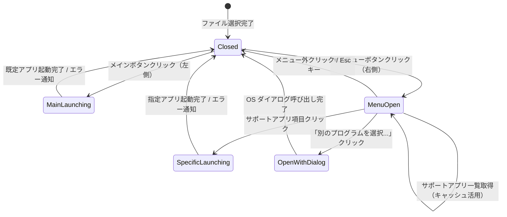
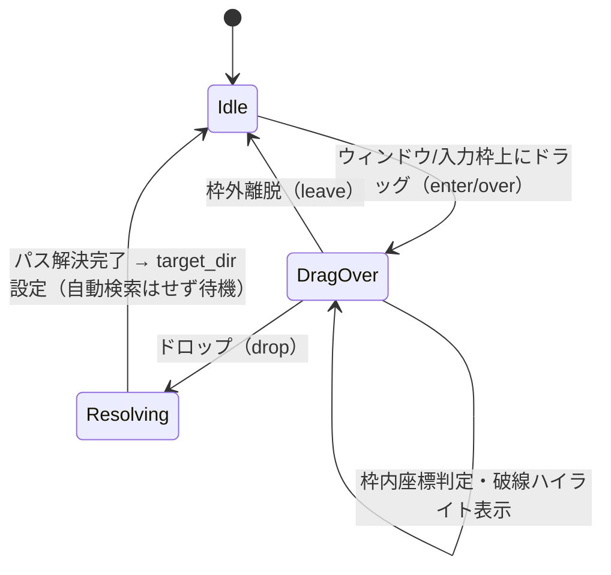

# データモデル設計書: xlsx/xls 登録アプリおよびサポートアプリ起動・フォルダDnD対応 (Data Model)

**機能ブランチ**: `002-launch-associated-app`  
**日付**: 2026-09-25  
**対象仕様書**: [spec.md](./spec.md)

---

## 1. 主要エンティティ定義

### 1.1 SupportedApp (サポートアプリケーション情報)

OS にインストールされている、`.xlsx` / `.xls` をサポートするアプリケーションのメタデータ構造。

| フィールド名 | 型 | 必須 | 説明 | 例 |
|:---|:---|:---:|:---|:---|
| `id` | `string` | ◯ | 一意の識別子（ProgID または実行ファイル名） | `"Excel.Sheet.12"`, `"soffice.bin"` |
| `name` | `string` | ◯ | ユーザー向け表示名 | `"Microsoft Excel"`, `"LibreOffice Calc"` |
| `executable_path` | `string` | ◯ | 実行可能ファイルの絶対パス | `"C:\\Program Files\\Microsoft Office\\root\\Office16\\EXCEL.EXE"` |
| `is_default` | `boolean` | ◯ | 現在 OS の既定アプリとして設定されているか | `true`, `false` |
| `icon_hint` | `string` (Optional) | - | アプリアイコンの種別・ヒント | `"excel"`, `"calc"`, `"generic"` |

**バリデーションルール**:
- `name` は空文字不可。取得できない場合は実行ファイルのベース名（例: `"EXCEL.EXE"`）をフォールバックとして使用。
- `executable_path` は存在確認（`Path::exists`）を行い、アンインストール済みの残骸エントリは除外。

---

### 1.2 AppLaunchRequest (アプリ起動要求)

フロントエンドからバックエンドへ送信されるファイル起動要求のパラメータ。

| フィールド名 | 型 | 必須 | 説明 | 例 |
|:---|:---|:---:|:---|:---|
| `file_path` | `string` | ◯ | 起動対象とする Excel ファイルの完全パス | `"C:\\Docs\\report.xlsx"` |
| `app_path` | `string` (Optional) | - | 指定アプリケーションの実行ファイルパス（省略時は OS 既定アプリで起動） | `"C:\\Program Files\\LibreOffice\\program\\scalc.exe"` |

**バリデーションルール**:
- `file_path` が存在すること。
- `app_path` が指定されている場合、そのパスが存在すること。

---

### 1.3 DroppedTarget (ドロップ対象情報)

フォルダ選択領域にドラッグ＆ドロップされたパスの解析・解決データ。

| フィールド名 | 型 | 必須 | 説明 | 例 |
|:---|:---|:---:|:---|:---|
| `source_path` | `string` | ◯ | ドロップされた元のファイル/フォルダパス | `"C:\\Work\\data.xlsx"` または `"C:\\Work"` |
| `resolved_dir` | `string` | ◯ | 解決された検索対象フォルダパス | `"C:\\Work"` |
| `is_directory` | `boolean` | ◯ | 元パスがディレクトリであったかどうか | `false`（ファイル時）, `true`（ディレクトリ時） |

---

## 2. 状態遷移 (State Transitions)

### 2.1 プレビューヘッダーのアプリ起動ボタンスプリットメニュー

### 2.2 フォルダDnD状態

