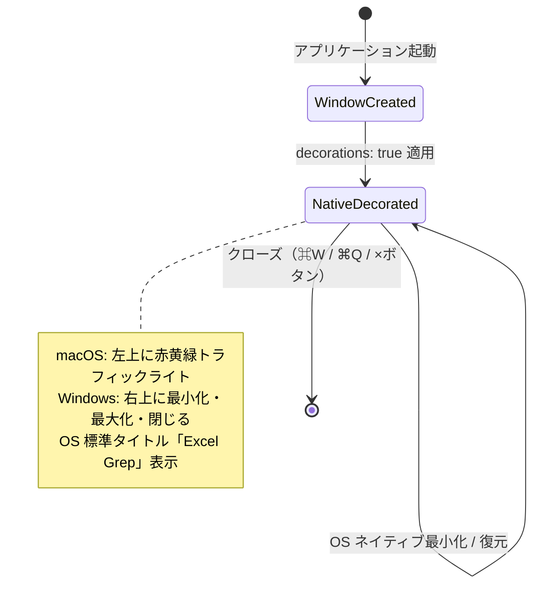
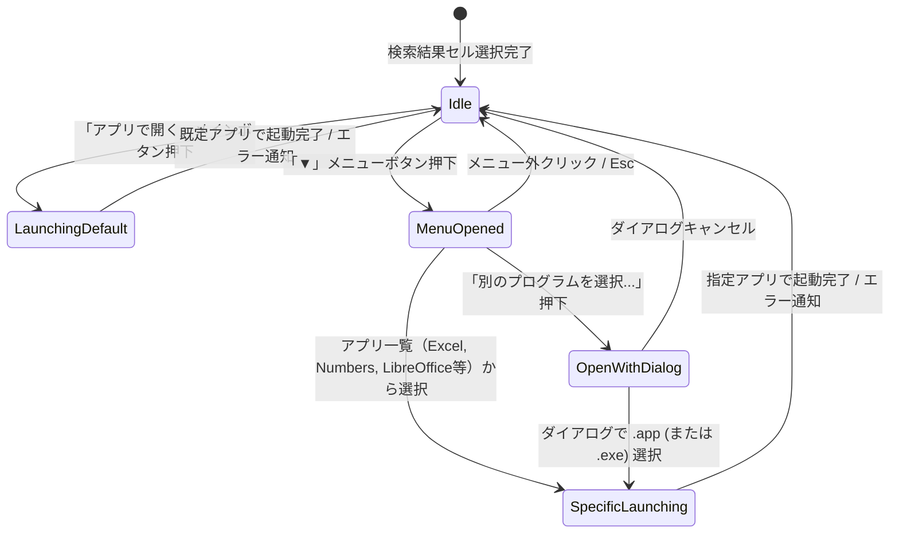

# データモデル設計書: マルチプラットフォーム対応 (macOS対応) (Data Model)

**機能ブランチ**: `003-macos-support`  
**日付**: 2026-09-25  
**対象仕様書**: [spec.md](./spec.md)

---

## 1. 主要エンティティ定義

### 1.1 SupportedApp (サポートアプリケーション情報)

OS にインストールされている、`.xlsx` / `.xls` を開くことができる表計算対応アプリケーションのメタデータ構造。macOS および Windows 双方で同一のインターフェースとして扱われます。

| フィールド名 | 型 | 必須 | 説明 | macOS 例 | Windows 例 |
|:---|:---|:---:|:---|:---|:---|
| `id` | `string` | ◯ | 一意識別子（Bundle ID または ProgID / 実行名） | `"com.microsoft.Excel"` | `"Excel.Sheet.12"` |
| `name` | `string` | ◯ | ユーザー向け表示名 | `"Microsoft Excel"` | `"Microsoft Excel"` |
| `executable_path` | `string` | ◯ | アプリケーションの絶対パス | `"/Applications/Microsoft Excel.app"` | `"C:\\...\\EXCEL.EXE"` |
| `is_default` | `boolean` | ◯ | 現在 OS の既定アプリであるか | `true` / `false` | `true` / `false` |
| `icon_hint` | `string` (Optional) | - | UI アイコン種別ヒント | `"excel"`, `"numbers"`, `"calc"`, `"generic"` | `"excel"`, `"calc"`, `"generic"` |

**バリデーションルール**:
- `name` は空文字不可。未取得時はバンドル名または実行ファイル名（例: `"Numbers.app"`）を使用。
- `executable_path` は存在確認（`Path::exists`）を行い、アンインストール済みの残骸エントリは除外。
- macOS 上ではアイコンヒントとして `"numbers"` を追加対応し、Numbers アプリに適切なアイコンまたはバッジを割り当て可能とする。

---

### 1.2 AppLaunchRequest (アプリ起動要求)

フロントエンドからバックエンドへ送信されるファイル起動要求パラメータ。

| フィールド名 | 型 | 必須 | 説明 | 例 |
|:---|:---|:---:|:---|:---|
| `file_path` | `string` | ◯ | 起動対象とする Excel ファイルの完全パス | `"/Users/user/Docs/budget.xlsx"` |
| `app_path` | `string` (Optional) | - | 指定アプリケーションのパス（省略時は OS 既定アプリで起動） | `"/Applications/Numbers.app"` |

**バリデーションルール**:
- `file_path` が存在すること。
- `app_path` が指定されている場合、そのアプリケーションパスが存在すること。
- macOS 上では `open -a "<app_path>" "<file_path>"` または `open "<file_path>"` を用いて起動する。

---

### 1.3 FolderRevealRequest (フォルダ表示要求)

対象ファイルをファイルマネージャー（macOS では Finder、Windows ではエクスプローラー）で選択・ハイライト表示するための要求。

| フィールド名 | 型 | 必須 | 説明 | 例 |
|:---|:---|:---:|:---|:---|
| `file_path` | `string` | ◯ | 表示対象ファイルの完全パス | `"/Users/user/Docs/data.xlsx"` |

**バリデーションルール**:
- `file_path` が存在すること。存在しない場合は即座にエラーメッセージを返却。
- macOS: `open -R "<file_path>"` を呼び出して Finder 上で選択表示。
- Windows: `explorer /select,"<file_path>"` を呼び出してエクスプローラー上で選択表示。

---

### 1.4 Window Configuration (ウィンドウ外観・動作定義)

Tauri ウィンドウ構成プロパティ。

| プロパティ名 | 型 | 設定値 | 説明 |
|:---|:---|:---:|:---|
| `title` | `string` | `"Excel Grep"` | OS ネイティブタイトルバーに表示されるタイトル |
| `decorations` | `boolean` | `true` | 全プラットフォーム共通で OS ネイティブ装飾を有効化 |
| `width` / `height` | `number` | `1280` / `850` | 初期ウィンドウ寸法 |
| `minWidth` / `minHeight` | `number` | `960` / `640` | 最小ウィンドウ寸法 |
| `resizable` | `boolean` | `true` | リサイズ許可 |

---

## 2. 状態遷移 (State Transitions)

### 2.1 ウィンドウライフサイクル & OS ネイティブ連携

### 2.2 外部アプリ選択起動 (macOS & Windows 共通 UX)

