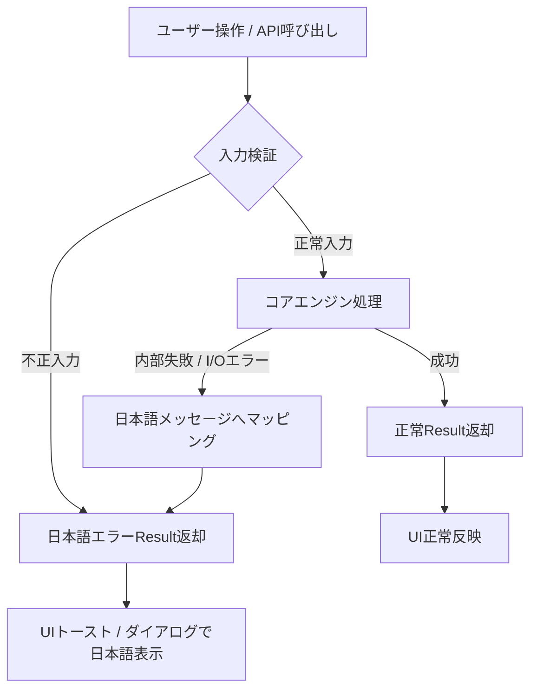

# Data Model: プロジェクト憲章準拠のプログラム改修

**Feature Branch**: `004-align-with-constitution`  
**Date**: 2026-09-26  
**Status**: Completed  

## 1. 定数管理モデル (Constant Registry Entities)

### Rust バックエンド定数構造 (`src-tauri/src/constants.rs`)

```text
Constants (Module)
├── FileExtensions (ファイル拡張子グループ)
│   ├── DEFAULT_EXTENSIONS: [&'static str; 4] = [".xlsx", ".xlsm", ".xlsb", ".xls"]
│   ├── EXT_XLSX: &'static str = ".xlsx"
│   ├── EXT_XLSM: &'static str = ".xlsm"
│   ├── EXT_XLSB: &'static str = ".xlsb"
│   └── EXT_XLS:  &'static str = ".xls"
├── ScanSettings (検索・スキャン設定グループ)
│   ├── PROGRESS_NOTIFY_INTERVAL_MS: u64 = 50
│   ├── CANCEL_CHECK_ROW_INTERVAL: u32 = 0x7F (127)
│   ├── SNIPPET_CONTEXT_CHARS: usize = 30
│   ├── SNIPPET_ELLIPSIS: &'static str = "..."
│   └── DEFAULT_MATCH_ID_START: u64 = 1
├── PreviewSettings (プレビュー設定グループ)
│   ├── PREVIEW_ROW_RADIUS: u32 = 15
│   └── PREVIEW_COL_RADIUS: u32 = 10
├── EventNames (Tauriイベント名グループ)
│   └── EVENT_SEARCH_PROGRESS: &'static str = "search-progress"
├── ExportHeaders (エクスポートヘッダーグループ)
│   └── CSV_EXPORT_HEADERS: [&'static str; 8] = [
│           "ID", "ファイル名", "フルパス", "シート名",
│           "セル位置", "一致種別", "一致内容", "数式"
│       ]
└── ErrorMessages (日本語エラーメッセージテンプレートグループ)
    ├── ERR_WORKBOOK_OPEN: &'static str = "ワークブックを開けませんでした: {path} ({error})"
    ├── ERR_SHEET_NOT_FOUND: &'static str = "指定されたシートが見つかりません: {sheet}"
    ├── ERR_EXPORT_FAILED: &'static str = "エクスポート処理に失敗しました: {error}"
    ├── ERR_INVALID_REGEX: &'static str = "不正な正規表現パターンです: {error}"
    └── ERR_PATH_NOT_FOUND: &'static str = "指定されたパスが存在しません: {path}"
```

### TypeScript フロントエンド定数構造 (`src/constants/index.ts`)

```text
UIConstants
├── EventNames
│   └── SEARCH_PROGRESS: "search-progress"
├── Commands
│   ├── START_SEARCH: "start_search"
│   ├── CANCEL_SEARCH: "cancel_search"
│   ├── GET_CELL_PREVIEW: "get_cell_preview"
│   ├── OPEN_IN_EXCEL: "open_in_excel"
│   ├── OPEN_IN_FOLDER: "open_in_folder"
│   ├── EXPORT_RESULTS: "export_results"
│   ├── RESOLVE_DROPPED_PATH: "resolve_dropped_path"
│   ├── GET_SUPPORTED_APPS: "get_supported_apps"
│   ├── LAUNCH_ASSOCIATED_APP: "launch_associated_app"
│   └── SHOW_OPEN_WITH_DIALOG: "show_open_with_dialog"
├── Timing
│   ├── TOAST_DURATION_MS: 3000
│   └── DEBOUNCE_DELAY_MS: 300
├── Layout
│   ├── RESULT_ROW_HEIGHT_PX: 36
│   ├── PREVIEW_CELL_WIDTH_PX: 100
│   └── PREVIEW_CELL_HEIGHT_PX: 24
└── Messages
    ├── SEARCHING: "検索中..."
    ├── COMPLETED: "検索が完了しました"
    ├── CANCELLED: "検索を中止しました"
    ├── NO_RESULTS: "一致する結果が見つかりませんでした"
    └── EXPORT_SUCCESS: "エクスポートが完了しました"
```

---

## 2. ヘッダドキュメントモデル (Header Documentation Contract)

すべてのコード構成要素が満たすべき4要素メタデータ構造：

| 項目 | 型 / フォーマット | 説明 | 必須性 |
| :--- | :--- | :--- | :--- |
| **1. 処理内容 (Description)** | テキスト | 対象要素の責務、振る舞い、アルゴリズムの詳細説明 | MUST |
| **2. 引数・戻り値 (Params & Return)** | 型シグネチャ + 説明 | 各引数の意味と戻り値（型、成功時/失敗時の内容） | MUST |
| **3. エラー / 例外 (Errors & Exceptions)** | 条件一覧 + エラー型 | `Result` 返却条件、想定されるエラー種別、panic排除の明記 | MUST |
| **4. 変更履歴 (Revision History)** | リスト (`vX.Y.Z (YYYY-MM-DD, Author): 内容`) | バージョン、日付、作成者、改修内容の明記 | MUST |

---

## 3. エラー契約モデル (Error Contract Model)

### 状態遷移とエラー伝搬



### バリデーションルール
1. **パニック排除**: `unwrap()` はテストコードを除き原則禁止。プロダクションコードでは `?` 演算子または `match` / `if let` による安全なエラー伝搬を行う。
2. **多言語エラーのローカライズ**: OSやライブラリの `std::io::Error`、`calamine::Error`、`rust_xlsxwriter::XlsxError` 等は、ユーザー向けの親切な日本語文言（`constants::ErrorMessages` 参照）に変換して返却する。
3. **不要トークンの排除**: メッセージ生成パイプラインにおいて、文字化けや `<PAD>`、`<pad>` が混入しないことを検証する。
