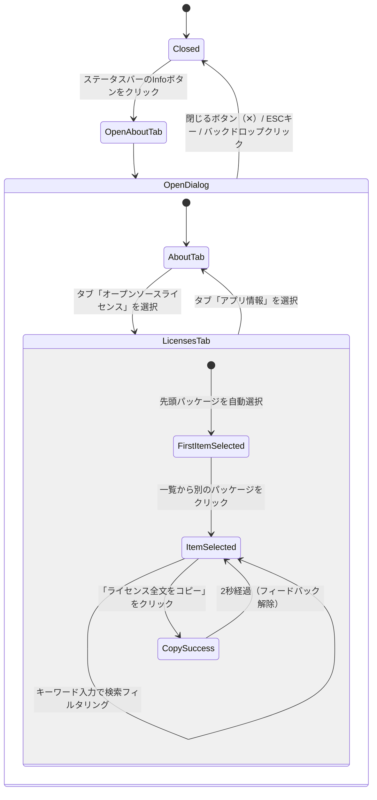

# Data Model: アプリ利用パッケージの著作権・ライセンス表示 (About Dialog & Package Licenses)

**Feature Branch**: `006-about-dialog-licenses`  
**Date**: 2026-09-26  
**Status**: Completed  

---

## 1. エンティティ定義 (Entity Definitions)

### 1.1 パッケージライセンスレコード (PackageLicenseRecord)

アプリケーションのバイナリ配布物に同梱・リンクされるサードパーティ製オープンソースソフトウェア（OSS）パッケージのライセンス・著作権情報。

| フィールド名 | 型 | 必須 | 説明 | バリデーション / 制約 |
|---|---|:---:|---|---|
| `id` | `string` | 必須 | レコードの一意識別子。形式: `{name}@{version}` | 空文字不可、一意性制約 |
| `name` | `string` | 必須 | パッケージ識別名（クレート名またはnpmパッケージ名） | 空文字不可、前後の空白トリム |
| `version` | `string` | 必須 | パッケージのセマンティックバージョン文字列 | セマンティックバージョニング形式（例: `1.0.0`） |
| `source` | `"rust" \| "npm"` | 必須 | パッケージの出自（バックエンドクレート or フロントエンドnpmパッケージ） | 定数文字列のいずれか |
| `license` | `string` | 必須 | SPDXライセンス識別子またはライセンス名称 | 例: `"MIT"`, `"Apache-2.0"`, `"MIT OR Apache-2.0"` |
| `author` | `string \| null` | 任意 | 著作者・開発元・著作権表記（Copyright notice） | 複数行表記および特殊記号を許容 |
| `repository` | `string \| null` | 任意 | パッケージのソースコードリポジトリまたは公式サイトURL | 有効なURL形式（`https://...`）または null |
| `license_text` | `string` | 必須 | 原著者によって提供された正規のライセンス全文 | 改行を含む等幅テキスト。空文字不可 |

---

### 1.2 アプリケーション基本情報 (AppMetaInfo)

Aboutダイアログの「アプリ情報」タブに表示されるアプリケーション自体のメタデータ。

| フィールド名 | 型 | 必須 | 説明 | 初期値 / 例 |
|---|---|:---:|---|---|
| `name` | `string` | 必須 | アプリケーション正式名称 | `"Excel Grep"` |
| `version` | `string` | 必須 | 現在のアプリケーションバージョン番号 | `"0.1.0"` (Cargo.toml / package.json と同期) |
| `description` | `string` | 必須 | アプリケーションの概要・説明文 | `"高速・セキュアなExcel専用ファイル内検索デスクトップアプリケーション"` |
| `copyright` | `string` | 必須 | アプリケーション全体の著作権表示文字列 | `"Copyright © 2026 Excel Grep Contributors"` |
| `license` | `string` | 必須 | アプリケーション自体の配布ライセンス | `"MIT License"` |

---

### 1.3 AboutダイアログUI状態 (AboutDialogState)

ダイアログの表示・非表示、タブ選択、検索・フィルタリング、およびマスター／ディテール連携を管理するUI状態。

| フィールド名 | 型 | 必須 | 説明 | 初期値 |
|---|---|:---:|---|---|
| `isOpen` | `boolean` | 必須 | ダイアログのモーダル表示状態フラグ | `false` |
| `activeTab` | `"about" \| "licenses"` | 必須 | 現在アクティブな表示タブ | `"about"` |
| `searchKeyword` | `string` | 必須 | パッケージ一覧のフィルタリング用検索文字列 | `""` |
| `selectedPackageId` | `string \| null` | 任意 | 2ペイン右側で詳細表示されているパッケージの `id` | ライセンス一覧の先頭パッケージID（一覧が空でない場合） |
| `copyFeedback` | `boolean` | 必須 | クリップボードコピー成功時の一時的視覚フィードバックフラグ | `false` (コピー後2秒間 `true`) |

---

## 2. 状態遷移とライフサイクル (State Transitions)

### 2.1 ダイアログ開閉フロー

### 2.2 検索フィルタリングと選択状態の保持ルール
1. **検索キーワード入力時**:
   - `searchKeyword` の変更に伴い、パッケージの `name` または `license` に部分一致（大文字小文字不問）するレコードのみをフィルタリング表示する。
   - フィルタリング後のリストに現在選択中の `selectedPackageId` が含まれる場合、選択状態をそのまま維持する。
   - フィルタリング後のリストに現在選択中の `selectedPackageId` が含まれなくなった場合、フィルタリング結果の先頭アイテムを自動的に新選択項目とする。
   - 一致するパッケージが0件となった場合、`selectedPackageId` は `null` となり、右ペインに「一致するパッケージが見つかりません」の案内プレースホルダーを表示する。
2. **検索クリア時**:
   - 検索入力欄のクリアボタン（✕）押下または全削除時、即座に全件表示へ復帰し、選択状態を保持する。

---

## 3. バリデーションおよび整合性ルール

1. **一意性保証**:
   - 同一の `id`（`{name}@{version}`）を持つレコードが複数存在してはならない。
2. **完全オフライン保証**:
   - すべての `PackageLicenseRecord` は静的データとして同梱され、実行時にネットワークからの読み込みを行わない。
3. **データ欠落時の安全対策**:
   - `license_text` が空文字列または取得不能な場合は、標準SPDXライセンスの既定テキストをフォールバックとして表示し、UIのクラッシュを防止する。
4. **憲章準拠の定数化**:
   - ダイアログに表示されるすべての日本語ラベル、見出し、タブ名、プレースホルダー文字列は `src/constants/index.ts` の定数オブジェクトから参照する。
