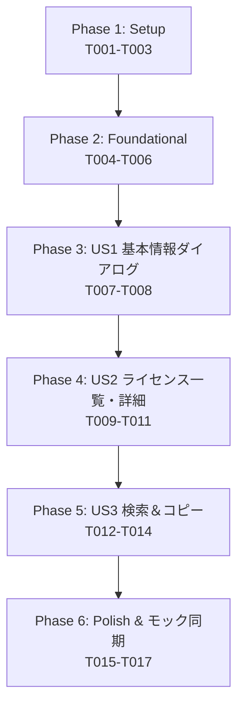

# Tasks: アプリ利用パッケージの著作権・ライセンス表示 (About Dialog & Package Licenses)

**Feature Branch**: `006-about-dialog-licenses`  
**Date**: 2026-09-26  
**Spec**: [spec.md](./spec.md) | **Plan**: [plan.md](./plan.md)  
**Status**: Ready for Implementation  

---

## Phase 1: Setup (Shared Infrastructure)

**Purpose**: ライセンス情報自動収集スクリプトの整備と静的バンドルデータの初期生成

- [X] T001 ライセンス収集スクリプトの作成 in `scripts/generate-licenses.py` (`cargo metadata --format-version 1` からRust実行時クレート情報を抽出、`npx license-checker --production --json` からnpmプロダクション依存情報を抽出し、各ライセンス本文を取得してマージ・ソートしたJSONを出力するPythonスクリプト。憲章原則III準拠の4要素ヘッダコメント付与)
- [X] T002 ライセンス収集スクリプトの実行とバンドル初期データの生成 in `src/constants/licenses.json` (`python3 scripts/generate-licenses.py` を実行し、[license-schema.json](./contracts/license-schema.json) に準拠した全本番依存パッケージの静的JSONデータを生成)
- [X] T003 [P] ライセンスおよびAboutダイアログ型定義ファイルの作成 in `src/types/license.ts` (`PackageLicenseRecord` (id: `{name}@{version}`, name, version, source, license, author, repository, license_text), `AppMetaInfo`, `AboutDialogState`, `AboutTabType` 等の型定義。憲章原則III準拠の4要素ヘッダコメント付与)

---

## Phase 2: Foundational (Blocking Prerequisites)

**Purpose**: 全ユーザーストーリー共通のUI定数定義、ステータスバー起動トリガー、および開閉状態管理の統合

**⚠️ CRITICAL**: ユーザーストーリーの実装開始前に本フェーズの共通基盤が完了している必要があります。

- [X] T004 [P] AboutダイアログUI定数セットの追加 in `src/constants/index.ts` (`ABOUT_DIALOG_CONSTANTS` を追加。ダイアログ見出し、アプリ概要、著作権文字列、検索プレースホルダー、ボタンラベル、トースト通知文言を定義し、ハードコードを排除。憲章原則I, II準拠)
- [X] T005 ステータスバーへのAboutボタン（Infoアイコン）配置とハンドラ統合 in `src/components/common/StatusBar.tsx` (エクスポートボタン群の右隣に縦仕切り線と情報アイコンボタン `Info` を配置。ツールチップ `ABOUT_DIALOG_CONSTANTS.BUTTON_ABOUT_TOOLTIP`、クリック時に `onOpenAbout` を発火するインターフェース拡張および4要素ヘッダコメント更新)
- [X] T006 アプリケーションルートでのAboutダイアログ開閉状態管理の統合 in `src/App.tsx` (`isAboutOpen` 状態を定義し、`StatusBar` の `onOpenAbout` ハンドラと連動。ダイアログのマウントスロットを用意し4要素ヘッダコメント更新)

**Checkpoint**: 共通基盤完了 - 各ユーザーストーリーの独立実装を開始可能

---

## Phase 3: User Story 1 - Aboutダイアログの起動とアプリ基本情報・著作権の確認 (Priority: P1) 🎯 MVP

**Goal**: メイン画面のステータスバー最右端（CSV/Excel出力ボタンの右隣）のInfoボタンからAboutダイアログをモーダル起動し、アプリ名（Excel Grep）、バージョン（0.1.0）、アプリ概要、著作権表示を確認できる。ESCキー、✕ボタン、バックドロップクリックで安全に閉じられる。

**Independent Test**: メイン画面下部ステータスバー右端のInfoボタンをクリックした際、画面中央に暗転バックドロップとともにAboutダイアログがモーダル表示され、「アプリ情報」タブにアプリ名・バージョン番号・アプリ著作権表示が正しく表示されること、およびESCキー/閉じるボタン/背景クリックでダイアログが閉じて元の画面状態が維持されることを確認する。

### Implementation for User Story 1

- [X] T007 [US1] Aboutダイアログシェルおよび「アプリ情報」タブの実装 in `src/components/about/AboutDialog.tsx` (モーダル外枠、半透明暗転バックドロップ、ESCキー押下イベント購読、バックドロップクリック検知、閉じるボタン `✕`、タブ切り替えヘッダー `アプリ情報` / `オープンソースライセンス`、および初期タブ `アプリ情報` のアプリ名・バージョン・概要・著作権表示レンダリング。憲章原則I, II, III準拠の4要素ヘッダコメント付与)
- [X] T008 [US1] アプリ情報タブの動作検証とダイアログ開閉の結合確認 in `src/App.tsx` (`AboutDialog` をマウントし、`isAboutOpen` の開閉連動と直前のメイン画面状態（検索結果やプレビュー表示）が完全に保持されることを確認)

**Checkpoint**: User Story 1 が独立して機能し、MVPとしてテスト可能

---

## Phase 4: User Story 2 - 全利用パッケージのライセンス一覧と詳細テキストの閲覧 (Priority: P1)

**Goal**: Aboutダイアログ内の「オープンソースライセンス」タブで、左右2ペイン（マスター／ディテール）構成により全パッケージ一覧を閲覧し、選択したパッケージの著作権情報および正規ライセンス全文を独立スクロールで閲覧できる。完全オフライン動作。

**Independent Test**: Aboutダイアログを開いて「オープンソースライセンス」タブを選択し、左ペインに全利用パッケージが一覧表示され、任意のパッケージをクリックすると右ペインにそのパッケージのバージョン、ライセンス種別、著作権表示、正規ライセンス全文がスクロール可能に表示されることを確認する。

### Implementation for User Story 2

- [X] T009 [P] [US2] パッケージ一覧コンポーネントの実装 in `src/components/about/PackageList.tsx` (左ペイン（幅40%）。`PackageLicenseRecord` 配列を行リスト表示。パッケージ名、バージョンバッジ、SPDXライセンス種別バッジ、選択行のアクティブハイライトスタイル。憲章原則III準拠の4要素ヘッダコメント付与)
- [X] T010 [P] [US2] パッケージ詳細ビューコンポーネントの実装 in `src/components/about/PackageDetail.tsx` (右ペイン（幅60%）。選択中パッケージのメタヘッダー（パッケージ名、バージョン、ライセンス種別、著作者名、リポジトリURL）、および独立スクロール可能な正規ライセンス全文エリア（等幅フォント、ダーク角丸コンテナ、長文スクロール対応）。未選択時の案内プレースホルダー表示。憲章原則III準拠の4要素ヘッダコメント付与)
- [X] T011 [US2] `AboutDialog.tsx` への左右2ペイン統合とライセンスデータバインディング in `src/components/about/AboutDialog.tsx` (`src/constants/licenses.json` をロードし、`PackageList` と `PackageDetail` を左右2ペインでレイアウト。「オープンソースライセンス」タブ選択時に初期状態で先頭パッケージを選択表示し、アイテムクリックによる詳細切り替えを連動)

**Checkpoint**: User Story 1 と User Story 2 が共に独立して機能し、テスト可能

---

## Phase 5: User Story 3 - パッケージライセンスの検索・絞り込みとコピー (Priority: P2)

**Goal**: パッケージ一覧のリアルタイムインクリメンタル検索・絞り込み（200ms以内、大文字小文字不問、全角半角対応、クリアボタン付き）と、選択パッケージのライセンス本文のワンクリッククリップボードコピー（ボタン一時表示変化とトースト通知）。

**Independent Test**: 検索欄に「mit」や「regex」等のキーワードを入力して200ms以内に絞り込まれ、クリア操作で復帰すること、および「ライセンス本文をコピー」ボタンをクリックした際、クリップボードに正規ライセンス全文がコピーされ「コピー完了」一時表示およびトースト通知が表示されることを確認する。

### Implementation for User Story 3

- [X] T012 [US3] パッケージ一覧へのインクリメンタル検索機能の実装 in `src/components/about/PackageList.tsx` (上部に検索入力欄とクリアボタン `✕` を配置。`name` および `license` フィールドに対する大文字小文字不問の部分一致フィルター、0件時の `NO_PACKAGES_FOUND` 案内メッセージ表示)
- [X] T013 [US3] クリップボードコピー機能と視覚フィードバックの実装 in `src/components/about/PackageDetail.tsx` (右ペイン上部アクションバーに「ライセンス本文をコピー」ボタンを配置。`navigator.clipboard.writeText` によるクリップボード書き込み、成功時のボタン一時変化（`BUTTON_COPIED` バッジ表示、2秒後復帰）、および `onShowToast` 発火。例外捕捉とエラー通知)
- [X] T014 [US3] `AboutDialog.tsx` での検索と選択状態の同期制御 in `src/components/about/AboutDialog.tsx` (フィルタリング結果に応じた選択アイテムの自動調整（現在選択中が除外された場合は先頭アイテムを自動選択、0件時はnull設定）と `onShowToast` の統合ハンドリング)

**Checkpoint**: すべてのユーザーストーリー（US1, US2, US3）が完全に統合され機能する

---

## Phase 6: Polish & Cross-Cutting Concerns

**Purpose**: デザインプロトタイプ（`design/mainui/index.html`）との完全同期およびコード品質・静的解析の検証

- [X] T015 スタンドアローンHTMLプロトタイプへのAboutダイアログ・ライセンス閲覧の完全同期 in `design/mainui/index.html` (スキル `syncing-mainui-mock`（Iron Law）に基づき、ステータスバーへのAboutボタン追加、AboutダイアログモーダルHTMLマークアップ、代表的パッケージデータ埋め込み、Vanilla JSでのタブ切り替え・検索・詳細表示・コピー・ESC閉鎖ロジックを完全同期実装)
- [X] T016 [P] クイックスタート検証ガイドの全シナリオ実行 in `specs/006-about-dialog-licenses/quickstart.md` (Scenario 1: ライセンスデータ生成検証、Scenario 2: Aboutダイアログ起動・基本情報確認、Scenario 3: ライセンス閲覧・検索・コピー検証、Scenario 4: 静的解析・ビルド検証を実行)
- [X] T017 [P] 静的解析・型チェック・フォーマット検証と憲章原則チェック in `package.json`, `src-tauri/Cargo.toml` (`npm run build` (`tsc --noEmit` & `vite build`), `cargo clippy --all-targets -- -D warnings`, `cargo fmt --check` を実行しエラー・警告ゼロを確認。定数外部抽出およびヘッダコメントの網羅性を検証)

---

## Dependencies & Execution Order

### Phase Dependencies

- **Phase 1 (Setup)**: 依存関係なし。即座に開始可能。
- **Phase 2 (Foundational)**: Phase 1 完了に依存。全ユーザーストーリーの実装をブロック。
- **Phase 3 (User Story 1 - MVP)**: Phase 2 完了に依存。ダイアログのコンテナ基盤を提供。
- **Phase 4 (User Story 2)**: Phase 3 完了に依存。ダイアログ内に2ペインライセンスビューを組み込み。
- **Phase 5 (User Story 3)**: Phase 4 完了に依存。一覧と詳細ペインに検索機能とコピー操作を付加。
- **Phase 6 (Polish & Cross-Cutting)**: 全ユーザーストーリー完了に依存。

---

## Parallel Opportunities

- **Phase 1**: T003（型定義作成）は T001/T002（スクリプト作成）と並行実行可能。
- **Phase 2**: T004（定数定義）と T005（ステータスバーUI）は並行実行可能。
- **Phase 4**: T009（PackageListコンポーネント）と T010（PackageDetailコンポーネント）は並行実行可能。
- **Phase 6**: T016（クイックスタート検証）と T017（静的解析・ビルド検証）は並行実行可能。

---

## Implementation Strategy

### MVP First (User Story 1 Only)
1. Phase 1（Setup: ライセンス収集基盤と型定義）を完了。
2. Phase 2（Foundational: 定数セットとステータスバーボタン）を完了。
3. Phase 3（User Story 1: Aboutダイアログの表示とアプリ基本情報・著作権表示）を完了。
4. **検証チェックポイント**: ステータスバーからAboutダイアログが起動し、アプリ情報が閲覧でき、スムーズに閉じることを確認（MVP達成）。

### Incremental Delivery (User Stories 2 & 3)
1. Phase 4（User Story 2）を追加: 左右2ペインのマスター／ディテール表示により、全パッケージライセンスの一覧と詳細本文閲覧が可能に。
2. Phase 5（User Story 3）を追加: リアルタイム検索フィルターとワンクリックコピーにより、利便性を向上。
3. Phase 6（Polish）: スタンドアローンHTMLモックと完全同期し、最終ビルド・品質ゲートを通過。

---

## Notes
- 全タスクはチェックリスト形式 `- [ ] [TaskID] [P?] [Story?] Description with file path` に厳格に準拠しています。
- 各タスク完了後はコミットを行い、進捗を確実に保存します。
- 憲章原則（日本語第一、定数抽出、4要素ヘッダコメント、モジュール設計、エラーハンドリング）およびモック同期ルールを常に遵守します。
