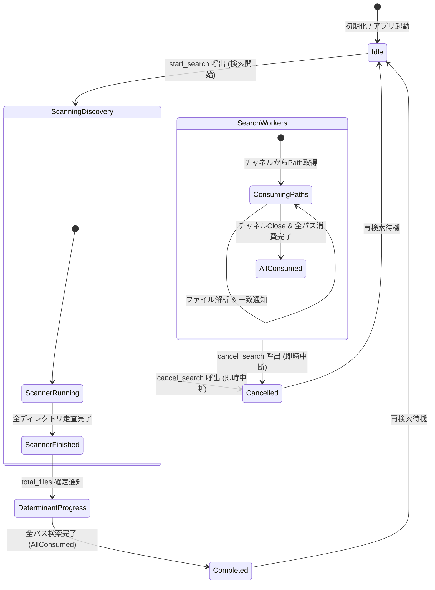

# Data Model & State Transitions: 並行ファイル走査・即時検索パイプライン (007-parallel-scan-search)

本ドキュメントは、ディレクトリスキャンとファイル内容検索のパイプライン並行処理における内部データモデル、状態管理、およびライフサイクル遷移を定義する。

---

## 1. 主要エンティティ (Key Entities)

### 1.1 検索パイプライン (Search Pipeline)
ディレクトリスキャン（プロデューサー）とファイル解析（コンシューマー）を同期チャネルを介して結合する並行実行構造。

| フィールド | 型 | 説明 |
| :--- | :--- | :--- |
| `cancel_flag` | `Arc<AtomicBool>` | 中断指示を全ワーカーおよびスキャナーへ伝達するアトミックフラグ |
| `discovered_count` | `Arc<AtomicUsize>` | スキャナーが検出した有効な対象ファイル（一時ファイル除外後）の累計件数 |
| `scanned_count` | `Arc<AtomicUsize>` | ワーカースレッドが検索を完了したファイル件数 |
| `match_count` | `Arc<AtomicUsize>` | これまでに発見された一致セルの総件数 |
| `scan_completed` | `Arc<AtomicBool>` | ディレクトリスキャンが末尾まで完了したか（総数が確定したか）を示すフラグ |
| `channel_tx` | `SyncSender<PathBuf>` | スキャナーがファイルパスを投入する有界同期チャネル送信端 |
| `channel_rx` | `Arc<Mutex<Receiver<PathBuf>>>` | ワーカースレッド群が処理対象パスを取り出す共有チャネル受信端 |

### 1.2 スキャン進捗モデル (Scan Progress: `ScanProgress`)
バックエンドからフロントエンド（Tauri IPC イベント `scan-progress`）へ一定周期（50ms以上）で送信される進捗DTO。

| フィールド | 型 | 説明 | 変更・検証ルール |
| :--- | :--- | :--- | :--- |
| `state` | `ScanState` | 検索全体の進行状態 (`Scanning`, `Completed`, `Cancelled`, `Error`) | 必須。キャンセル時は速やかに `Cancelled` へ遷移 |
| `scanned_files` | `usize` | 検索処理済みのファイル数 | 0以上の整数。単調増加 |
| `total_files` | `usize` | 対象ファイル総数 | **スキャン完了前は `0`**（未確定状態）、**スキャン完了後は確定件数** |
| `matches_found` | `usize` | 発見された一致セルの総件数 | 0以上の整数。単調増加 |
| `current_file` | `String` | 現在処理中のファイル名、またはステータスメッセージ | 画面表示用文字列（UTF-8） |
| `elapsed_ms` | `u64` | 検索開始からの経過ミリ秒 | 開始時刻からの経過ミリ秒 |

---

## 2. 状態遷移 (State Transitions)

### 遷移詳細

1. **`Idle` → `ScanningDiscovery` (並行開始)**:
   - `start_search` コマンド受信。
   - `cancel_flag` を `false` にリセット。
   - `sync_channel(1024)` を生成。
   - スキャナースレッドを起動（`WalkDir` 開始）。
   - 同時に Rayon スレッドプールでワーカースレッド群を起動し、チャネルからの受信を開始。
   - 初期進捗: `state: Scanning`, `scanned_files: 0`, `total_files: 0`。

2. **`ScanningDiscovery` 実行中 (パイプライン処理中)**:
   - スキャナーが検出したパスを随時チャネルへ投入。
   - ワーカーは届いたパスから順次 `parse_and_search_file` を実行し、一致があれば `on_match` で即時イベント送出。
   - 進捗通知: `state: Scanning`, `total_files: 0`, `scanned_files: X`。UIは「検出・走査中」アニメーションを表示。

3. **`ScanningDiscovery` → `DeterminantProgress` (スキャン完了 & 総数確定)**:
   - スキャナーが全探索を終えると、`scan_completed` が `true` になり、送信端 `channel_tx` がドロップされる。
   - 確定総数 `total_discovered` を反映した進捗通知が送信される（`total_files = N`）。
   - UIは確定パーセンテージバーへと切り替わる。

4. **`DeterminantProgress` → `Completed` (正常完了)**:
   - ワーカーがチャネル内の全残余パスを消化し終えると、検索エンジンループが終了。
   - 最終進捗 `state: Completed`, `scanned_files: N`, `total_files: N` を送信。

5. **`Any State` → `Cancelled` (即時中断)**:
   - `cancel_search` コマンド受信。
   - `cancel_flag.store(true, Ordering::Relaxed)`。
   - スキャナーは次の `WalkDir` エントリ評価時（1ms未満）に即座にループを抜け、スレッドを終了。
   - ワーカーも現在のシート走査または次のチャネル受信時に即座にループを抜ける。
   - 中断時点までに発見された結果を保持したまま `state: Cancelled` の最終進捗を送信。
