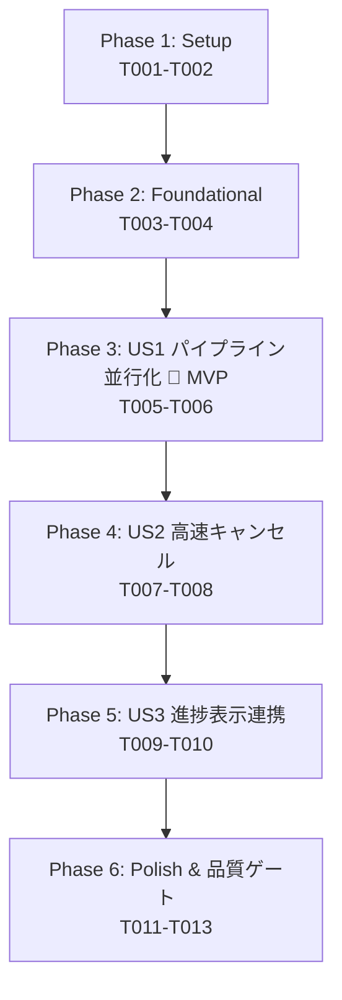

# Tasks: 並行ファイル走査・即時検索パイプラインと高速キャンセル応答 (007-parallel-scan-search)

**Feature Branch**: `007-parallel-scan-search`  
**Date**: 2026-09-26  
**Spec**: [spec.md](./spec.md) | **Plan**: [plan.md](./plan.md)  
**Status**: Ready for Implementation  

---

## Phase 1: Setup (Shared Infrastructure)

**Purpose**: バックエンドおよびフロントエンドにおける定数定義の整備と一元管理

- [ ] T001 [P] バックエンド定数の定義追加と単体テスト作成 in `src-tauri/src/constants.rs` (`CHANNEL_BUFFER_SIZE: usize = 1024`, `MSG_SCAN_DISCOVERING`, `MSG_FILES_DISCOVERING_PREFIX` 等の定数追加および単体テスト `test_pipeline_constants` の追加。憲章原則II, III準拠)
- [ ] T002 [P] フロントエンド定数セットの追加 in `src/constants/index.ts` (`STATUS_DISCOVERING_FILES`, `STATUS_DISCOVERING_PREFIX` 等のUI定数定義を追加し、ハードコードを排除。憲章原則I, II準拠)

---

## Phase 2: Foundational (Blocking Prerequisites)

**Purpose**: `collect_files` のシグネチャ拡張とキャンセル即時応答化（US1, US2双方の基盤）

**⚠️ CRITICAL**: ユーザーストーリーの実装開始前に本フェーズの共通基盤が完了している必要があります。

- [ ] T003 `SearchEngine::collect_files` のシグネチャ拡張と即時中断ロジックの実装 in `src-tauri/src/search/engine.rs` (`cancel_flag: Option<&AtomicBool>` を引数に追加し、`WalkDir` 反復ループ内で毎エントリ `flag.load(Ordering::Relaxed)` を評価して `true` 時に即座に `break` する処理を追加。一時ファイル除外の維持。憲章原則III準拠の4要素ヘッダコメント更新)
- [ ] T004 [P] `collect_files` のキャンセル即時中断単体テストの追加 in `src-tauri/src/search/engine.rs` (`test_collect_files_cancellation` を追加し、キャンセルフラグがセットされた際に直ちに走査が打ち切られることを検証)

**Checkpoint**: 共通基盤完了 - 各ユーザーストーリーの独立実装を開始可能

---

## Phase 3: User Story 1 - 大規模ディレクトリにおける検索開始および初回結果表示の即時化 (Priority: P1) 🎯 MVP

**Goal**: `SearchEngine::execute_search` において、`collect_files` と `file_list.par_iter()` のシーケンシャル実行を刷新し、ディレクトリスキャナースレッド（プロデューサー）と Rayon 並列ワーカー（コンシューマー）を `std::sync::mpsc::sync_channel(CHANNEL_BUFFER_SIZE)` で結合するパイプライン並行処理を実装。最初のファイル検出と同時に即座に検索を開始し、初回結果表示時間（TTFR）を最小化する。

**Independent Test**: フィクスチャディレクトリや多数のファイルを含むフォルダを対象に検索を実行し、全ファイル検出完了前に最初のファイルの一致イベントが即座にコールバックされること、および全検索結果の件数・整合性が従来と完全一致することを検証する。

### Implementation for User Story 1

- [ ] T005 [US1] `SearchEngine::execute_search` へのプロデューサー・コンシューマー・パイプライン並行処理の実装 in `src-tauri/src/search/engine.rs` (`std::sync::mpsc::sync_channel(CHANNEL_BUFFER_SIZE)` を生成し、スキャナースレッドを起動して検出パスを順次送信。Rayon 並列ワーカー群が `Arc<Mutex<Receiver<PathBuf>>>` からパスを取得して即座に `parse_and_search_file` を実行。スキャン完了フラグ `scan_completed` と `total_discovered` の管理。憲章原則III準拠の4要素ヘッダコメント更新)
- [ ] T006 [US1] パイプライン並行検索エンジンの単体テスト追加 in `src-tauri/src/search/engine.rs` (`test_search_engine_parallel_pipeline` を追加。検出と検索が並行動作し、全結果が欠損や重複なく正しく取得できることを検証)

**Checkpoint**: User Story 1 が独立して機能し、MVPとしてテスト可能

---

## Phase 4: User Story 2 - ディレクトリ走査中および検索中の即時キャンセルと高応答性 (Priority: P1)

**Goal**: 検索開始直後やディレクトリスキャン進行中の段階において `cancel_search` が発行された際、スキャナースレッドおよび全ワーカースレッドが 1 秒以内（通常ミリ秒オーダー）で安全に即時中断し、UIが即座に再検索可能な状態に戻る。

**Independent Test**: 検索開始直後（ディレクトリスキャン進行中）に `cancel()` を呼び出し、1秒未満でスキャンおよび検索処理が完全停止し、最終状態が `ScanState::Cancelled` となり部分結果が保持されることを検証する。

### Implementation for User Story 2

- [ ] T007 [US2] パイプライン並行処理におけるスキャナーおよびワーカーの即時中断協調の実装 in `src-tauri/src/search/engine.rs` (スキャナースレッドでのチャネル送信エラー時の即時脱出、ワーカー側での受信待機中キャンセル検知と早期終了、および `ScanState::Cancelled` 状態の正確な返却。憲章原則III準拠の4要素ヘッダコメント更新)
- [ ] T008 [US2] ディレクトリスキャン進行中の即時中断単体テストの追加 in `src-tauri/src/search/engine.rs` (`test_search_engine_cancellation_during_scan` を追加。検索開始直後にキャンセルを発行し、即座に安全に停止して `ScanState::Cancelled` が返ることを検証)

**Checkpoint**: User Story 1 と User Story 2 が共に独立して機能し、テスト可能

---

## Phase 5: User Story 3 - 並行走査時における正確かつ直感的な進捗状況の可視化 (Priority: P2)

**Goal**: ディレクトリスキャン継続中（総数未確定時）は `total_files = 0` として進捗イベントを発行し、フロントエンドのステータスバーで「検出・走査中 (N ファイル)」アニメーションパルスを表示。スキャン完了後は確定総数を反映して正規の確定パーセンテージバー表示へスムーズに移行する。

**Independent Test**: 長時間の検索またはフィクスチャ検索において、スキャン中はパルスアニメーションと走査済件数が表示され、スキャン完了後に正確な確定パーセンテージ（例: `50% (10/20)`）へ切り替わることをブラウザ/UI上で確認する。

### Implementation for User Story 3

- [ ] T009 [US3] バックエンドでの未確定時および確定時進捗イベント通知ロジックの実装 in `src-tauri/src/search/engine.rs` (`scan_completed` が `false` の間は `total_files: 0` を送信し、スキャン完了時に確定した総ファイル数で進捗通知を送信。最終完了通知の統合。憲章原則III準拠の4要素ヘッダコメント更新)
- [ ] T010 [US3] ステータスバーUIでの未確定時アニメーション表示と確定時プログレスバー切り替えの実装 in `src/components/common/StatusBar.tsx` (`isScanning && (progress.total_files === 0 || progress.scanned_files === 0)` 時のパルスアニメーション表示、テキスト表示 `検出・走査中 (${progress.scanned_files} ファイル)` の追加、および確定後のパーセンテージ計算連携。定数参照化。憲章原則I, II, III準拠の4要素ヘッダコメント更新)

**Checkpoint**: すべてのユーザーストーリー（US1, US2, US3）が完全に統合され機能する

---

## Phase 6: Polish & Cross-Cutting Concerns

**Purpose**: スタンドアローンHTMLモック（`design/mainui/index.html`）との完全同期およびコード品質・静的解析の検証

- [ ] T011 スタンドアローンHTMLプロトタイプへのステータスバー未確定時アニメーション・テキスト表示の完全同期 in `design/mainui/index.html` (スキル `syncing-mainui-mock`（Iron Law）に基づき、スキャン中の検出中パルス表示およびファイル数表示ロジックを同期実装)
- [ ] T012 [P] クイックスタート検証ガイドの全シナリオ実行 in `specs/007-parallel-scan-search/quickstart.md` (単体テスト検証、大規模走査・TTFR検証、即時キャンセル検証、空フォルダ検証)
- [ ] T013 [P] バックエンドおよびフロントエンドの品質ゲート検証 in `src-tauri/Cargo.toml`, `package.json` (`cargo test`, `cargo clippy --all-targets -- -D warnings`, `cargo fmt --check`, `npm run build` を実行し、全テストパスおよびエラー・警告ゼロを確認。定数外部抽出・ヘッダコメントの網羅性を検証)

---

## Dependencies & Execution Order

### Phase Dependencies

### User Story Dependencies

- **User Story 1 (P1)**: Foundational (Phase 2) 完了後に着手可能。他ストーリーへの依存なし。
- **User Story 2 (P2)**: US1 のパイプライン構造の上で、中断シグナルの協調停止を実装（US1 完了後に着手）。
- **User Story 3 (P3)**: US1, US2 のスキャン完了フラグおよび総数管理を基盤として、進捗通知およびUI描画を実装。

### Parallel Opportunities

- Phase 1 内: T001 (Rust定数) と T002 (TypeScript定数) は完全並列可能。
- Phase 2 内: T003 (実装) 完了後、T004 (単体テスト) を実行可能。
- Phase 6 内: T011 (HTMLモック同期)、T012 (クイックスタート検証)、T013 (品質ゲート検証) を効率的に連携可能。

---

## Implementation Strategy

### MVP First (User Story 1 Only)
1. Phase 1 (Setup: 定数定義) を完了。
2. Phase 2 (Foundational: `collect_files` のシグネチャ更新) を完了。
3. Phase 3 (User Story 1: パイプライン並行化) を実装。
4. **STOP and VALIDATE**: `cargo test` で並行パイプラインの動作を単体検証（MVP完成）。

### Incremental Delivery
1. Setup + Foundational 完了 → 基盤確立。
2. User Story 1 完了 → 初回結果表示の即時化（TTFR改善）。
3. User Story 2 完了 → スキャン中の即時中断保証。
4. User Story 3 完了 → スキャン中アニメーションと確定進捗率の自然な切り替え。
5. Polish 完了 → HTMLモック同期・Clippy・Format・ビルド検証。
