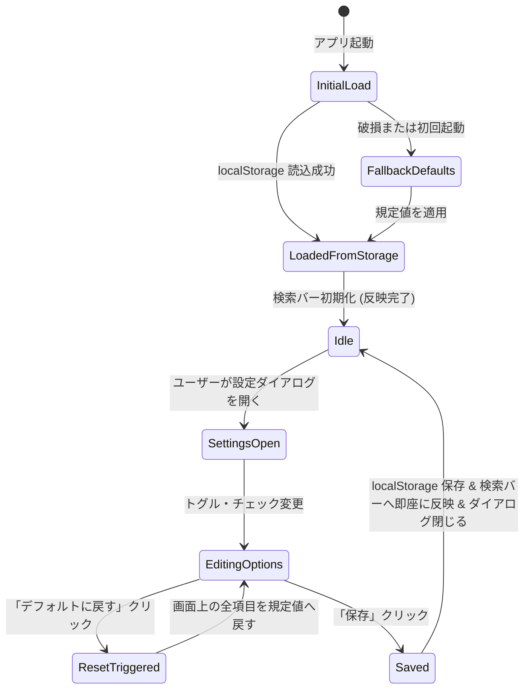

# データモデル設計 (Data Model): デフォルト動作設定

## エンティティ定義

### 1. DefaultSearchOptions (デフォルト検索オプション)
ユーザーが設定ダイアログで指定し、ローカルストレージに永続化される検索初期設定。

| フィールド | 型 | 必須 | 規定値 | 説明・制約 |
|:---|:---|:---:|:---:|:---|
| `match_case` | boolean | 必須 | `false` | 大文字/小文字を区別するかのデフォルト (OFF) |
| `use_regex` | boolean | 必須 | `false` | 正規表現を使用するかのデフォルト (OFF) |
| `include_formula` | boolean | 必須 | `true` | 数式を検索対象に含めるかのデフォルト (ON) |
| `include_shape` | boolean | 必須 | `false` | Shape内テキストを検索対象に含めるかのデフォルト (OFF) |
| `include_comment` | boolean | 必須 | `true` | コメント/メモを検索対象に含めるかのデフォルト (ON) |
| `include_hidden` | boolean | 必須 | `false` | 非表示シートを検索対象に含めるかのデフォルト (OFF) |
| `extensions` | string[] | 必須 | `[".xlsx", ".xlsm", ".xlsb", ".xls"]` | 対象拡張子のデフォルトリスト。最低1件以上必須。 |

#### バリデーションルール
1. **型整合性**: 全ブール値フィールドが厳密に `boolean` であること。
2. **拡張子配列**: `extensions` が配列であり、要素が全て空文字でなく `.xlsx`, `.xlsm`, `.xlsb`, `.xls` の部分集合であること。最低1つ以上選択されていること（空配列は無効）。
3. **フォールバック保証**: ストレージからの読込時、パース失敗やバリデーション違反を検知した場合は直ちに上記規定値（公式デフォルト値）で自動補正する。

---

### 2. ExportTask (出力タスク)
検索結果をファイル出力する際の一時エンティティ。

| フィールド | 型 | 必須 | 説明・制約 |
|:---|:---|:---:|:---|
| `format` | `"csv"` \| `"xlsx"` | 必須 | 出力ファイルフォーマット |
| `destination_path` | string | 必須 | OSの保存ダイアログでユーザーが選択した書き込み先パス |
| `language` | DisplayLanguage | 必須 | ヘッダー等の出力ローカライズ言語 (`"ja"` \| `"en"`) |
| `items` | SearchMatch[] | 必須 | 出力対象の検索一致データ配列 (0件時は実行不可) |

---

## 状態遷移 (State Transitions)

