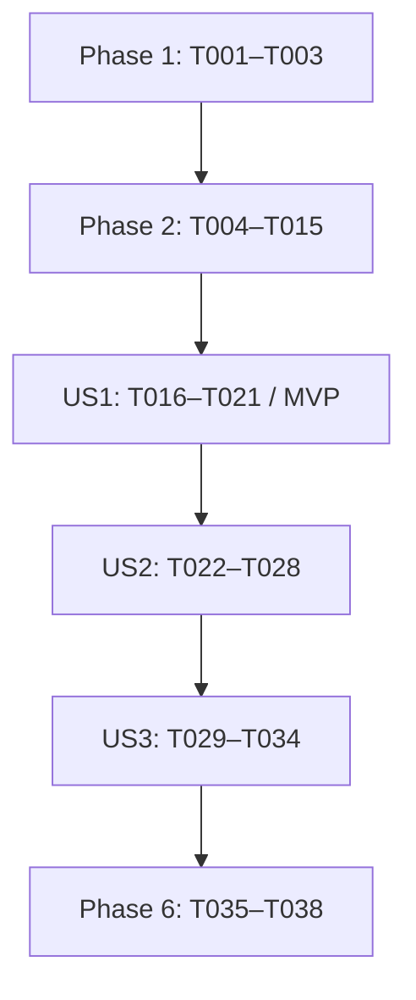

<!-- 処理内容: CLI検索・結果保存の実装作業をユーザーストーリー別・依存順に定義する。入力・出力: spec.md、plan.md、research.md、data-model.md、contracts/cli.md、quickstart.mdを入力とし、実行可能なタスクと完了条件を出力する。エラー: 未達の検証を完了扱いにせず、依存関係と環境上の未確認事項を記録する。変更履歴: v1.0.0 2026-09-29 Codex 初版作成。v1.0.1 2026-09-29 Codex 整合性分析の指摘を反映。 -->
# Tasks: コマンドライン検索・結果保存

**入力**: `specs/014-cli-search-export/` の設計文書。ブランチ: `014-cli-search-export`。

**前提**: [計画](plan.md)、[仕様](spec.md)、[調査](research.md)、[データモデル](data-model.md)、[CLI契約](contracts/cli.md)、[検証ガイド](quickstart.md)。

**テスト**: AGENTS.mdと憲章原則Vに従い、変更する検索・保存処理とCLI契約を検証するタスクを含める。テストを先に追加し、未実装の対象挙動で失敗することを確認する。フィクスチャの不備や構文エラーを挙動検証の失敗と混同しない。

**構成**: Phase 1/2は共有基盤、Phase 3/4/5は仕様のUS1/US2/US3、Phase 6は共通の仕上げと検証。新しいコアクレート・引数解析フレームワークは作らない。

## Format: `[ID] [P?] [Story] Description`

`[P]` は前提タスクが完了した後に、別ファイルを変更する作業と並行できることを示す。ストーリー内のタスクには必ず `[US1]`、`[US2]`、`[US3]` を付ける。タスク中のパスはリポジトリルート基準。

## Path Conventions

Rust実装は `src-tauri/src/`、統合テストは `src-tauri/tests/`、共有フィクスチャは `tests/fixtures/`、Cargo.lockはworkspaceルート。各コード変更では4要素ヘッダ、定数定義と参照コメント、対応するテスト更新を同じ作業に含める。

## Phase 1: Setup（共有の準備）

**目的**: 既存パッケージの中でCLIをビルドできる状態と、共通定数・翻訳を用意する。

- [X] T001 [P] `src-tauri/Cargo.toml` に `default-run = "exlgrep"` とロック済みserde_yaml・same-fileの直接依存を設定し、ルート `Cargo.lock` を更新する。`src-tauri/src/bin/exlgrep-cli.rs` にビルド可能なコンソール入口を置き、GUI起動・Windowsコンソール抑制を行わない。本体接続はT020で行う。
- [X] T002 [P] `src-tauri/src/constants.rs` にCLIオプション名・既定値・終了コード0/1/2・翻訳キー・同梱カタログパス・一時領域名・検証用固定値を定義し、コメント解析のレコードID・上限は `research.md` の一次資料で確認して定義する。既存の拡張子・言語・出力定数は再利用する。
- [X] T003 [P] `src-tauri/locales/ja.yml` と `src-tauri/locales/en.yml` に同じCLI翻訳キーを追加し、ヘルプ、入力不備、ファイル問題、保存失敗、完了要約を自然な日英表現で定義する。既存exportキーは共有する。

**チェックポイント**: CLIのビルド対象と日英の同じ翻訳キーが存在し、既存GUIの既定バイナリを維持できる。

## Phase 2: Foundational（全ストーリーの前提）

**目的**: CLIとGUIが同じ正しい検索コアを利用し、単一ファイル・コメント・部分失敗を扱えるようにする。

### 共通型・カタログ・先行テスト

- [X] T004 [P] `src-tauri/src/models/mod.rs` に「追加する `include_value: bool` は既定true」「既存JSON要求では省略可能」を実装し、FileSearchResult・SearchIssue・SearchReportを定義する。「件数はusize、時間はu64、重複問題があってもfailed_filesはブック単位」「任意のsheet_name」、stageの「探索/ブック/シート/数式/Shape/コメント」、causeの「エラー分類と原因」、「panicもファイル問題へ変換」を守る。`src-tauri/src/search/engine.rs`、`src-tauri/src/commands/search_cmd.rs`、`src-tauri/tests/shape_extract.rs` の全SearchQuery初期化を更新し、「既存のShapeのSerde既定値を無関係に変更しない」を守り、省略時の互換性を型の単体テストで確認する。
- [X] T005 [P] `src-tauri/src/i18n.rs` に同梱YAMLから二重BTreeMapを取得する関数を追加し、`_version` を翻訳項目から除外する。既存 `resolve_catalog_text` を使い、必須キー欠落・不正カタログをResultで通知する。ja/enの読取、数値メタデータの除外、既存export見出しを単体テストで確認する。
- [ ] T006 [P] `tests/fixtures/cli/` に有効なxlsx・xlsm・xls・xlsbの小さなブックと、現行コメント/返信、従来メモ、通常Shape、非表示シート、A1以外の開始セルを含む必要なフィクスチャを用意する。`tests/fixtures/cli/README.md` に各ファイルの生成元・実形式・期待座標と本文を記録する。既存 `tests/fixtures/sample_report.xlsx` のA12メモは再利用し、拡張子変更だけの偽形式で代替しない。
- [ ] T007 `src-tauri/tests/shape_extract.rs` に共有parserの回帰テストを追加し、A12の値/メモ、数式の実座標、4形式のメモ、現行コメントの返信、メモとShapeの二重計上防止、非表示設定、部品の破損、空ファイルの読取失敗、有効な空ブックの0件、極小/極大セル値（負の微小値・大きな有限値・短い/長いUnicode本文）を既知の期待値で検証する。T004/T006完了後に未実装の挙動で失敗することを確認する。

### 共有部品と形式別抽出

- [ ] T008 `src-tauri/src/search/shape/ooxml.rs`、`src-tauri/src/search/shape/xls.rs`、`src-tauri/src/search/shape/xlsb.rs` の既存ZIP・relationships・CFB・文字列・レコード読取をコメント処理から必要な範囲だけ利用可能にする。relationshipsへType/TargetModeを保持し、外部参照は取得せず問題として通知する。既存の境界検証・読取上限を維持し、汎用読取フレームワークへ作り直さない。
- [ ] T009 `src-tauri/src/search/comments/mod.rs` と `src-tauri/src/search/mod.rs` に形式別抽出の共通入口を追加する。CommentTextは `sheet_name: String`、`row: u32`、`col: u32`、`text: String` とし、「行列は1始まり」「投稿IDと親IDは抽出中の結合・重複回避にだけ使い、検索結果へ保存しない」「関係がない場合は空一覧、参照部品の破損・境界超過・外部参照は検索問題として扱う」を守る。
- [ ] T010 [P] `src-tauri/src/search/comments/ooxml.rs` にxlsx/xlsmのcomments XMLとthreadedComments XMLの抽出を実装する。シートrelationshipsからセルと本文を解決し、id/parentIdで返信のセルを継承する。「現行コメントの各投稿・返信はセルと本文を持つ。互換用メモに同じ内容を重複して出さない」を満たし、分割本文・欠落参照・境界値を単体テストで確認する。
- [ ] T011 [P] `src-tauri/src/search/comments/xls.rs` にWorkbook/Book、BoundSheet、NoteSh.idObj、Obj/FtCmo、TxO/Continueを使うxlsメモ抽出を実装する。object IDで対応づけ、レコード順序へ依存しない。Unicode、分割Continue、不正境界、メモと通常図形の混在を単体テストで確認する。
- [ ] T012 `src-tauri/src/search/comments/xlsb.rs` にBrtBundleShとrelationshipsからBrtBeginComment/BrtCommentText/RichStrを読むxlsbメモ抽出を実装する。T010完了後に現行コメントXMLの共通処理を利用する。バイナリ本文・座標・不正境界を単体テストで確認する。
- [ ] T013 `src-tauri/src/search/parser.rs` に詳細検索結果を返す処理を追加し、既存 `parse_and_search_file` は互換ラッパーにする。値検索切替、range開始位置を加えた座標、コメント結果と非表示除外を接続し、「コメント/メモは `MatchType::Comment`」「Shape名と数式はNone、セル番地と所属シートを持つ」「値・数式はrangeの開始位置を加算して実セルの位置を表す」「新しい出力列は追加しない」を守り、SearchMatchの既存フィールドを維持する。「ブックを開けない場合はErr、開けたブックの一部抽出失敗はissuesに保持して他の項目を返す」を満たす。`src-tauri/src/search/shape/xls.rs` のメモTxOをShapeから除外し、`src-tauri/src/search/shape/mod.rs` の拡張子比較を大小文字非依存へ揃える。
- [ ] T014 `src-tauri/src/search/engine.rs` に単一ファイル/フォルダーの詳細実行、検出した入力パスの通知、探索/ファイル問題の集計を追加し、既存 `execute_search` を互換ラッパーにする。WalkDirエラー、parserのissues、捕捉したpanicをレポートへ記録する。既存rayon・容量制限付きキュー・キャンセルを維持し、事前の全パス一覧化や二度目の検索を追加しない。単一入力、混在する破損入力、探索失敗、キャンセルを単体テストで確認する。
- [ ] T015 `src-tauri/tests/shape_extract.rs` と `src-tauri/src/search/engine.rs` の回帰テストを実行し、T007の先行テストと既存GUI向け検索・Shape・キャンセルテストが通ることを確認する。`src-tauri/src/models/mod.rs` の省略フィールド互換と既存ScanProgress JSON契約も確認する。

**チェックポイント**: 4形式・全検索種別の正しい結果と問題情報を共有コアから取得できる。ここまでが全ストーリーの必須前提。

## Phase 3: US1 — GUIを使わない検索と結果保存（P1、MVP）

**目的**: 必須引数と既定条件だけで、GUIを起動せず結果を安全にCSV/XLSXへ保存する。

**独立検証**: 単一ファイルと再帰フォルダー検索で両出力を作成し、正常な0件でも見出しを保存して0で終了する。ID/行順を除く内容・件数が共有コア/GUIと一致し、A12などの既知座標も正しい。

### 先行テスト

- [ ] T016 [P] [US1] `src-tauri/tests/cli_search.rs` にCLIを実プロセスで起動するテストを作成し、必須引数、単一/再帰検索、CSV/XLSX、空フォルダー/0件、既定日本語、4形式の既知結果と共有コアとの多重集合一致を検証する。「結果比較はIDと行順を除いたファイル・シート・セル・一致種別・全文・数式・Shape名の多重集合で行う」を守る。バイナリはCargoのテスト用パスで取得し、T001の入口に対して未実装の結果保存が失敗することを確認する。

### 実装

- [ ] T017 [P] [US1] `src-tauri/src/cli/args.rs` にCliOptionsと必須4引数の解析を実装する。queryは「空の検索語は禁止」、input_pathは「正規化した既存のファイルまたはディレクトリ」、output_pathは「既存の親ディレクトリ内の通常ファイル保存先」、formatは「Csv または Xlsx」、languageは「ja または en、既定ja」、overwriteは「既定false。入力ファイルを保護する条件は解除しない」。既定のSearchQueryを固定値から構築し、args_osの非Unicodeはエラーにする。
- [ ] T018 [P] [US1] `src-tauri/src/cli/output.rs` に既定保存のOutputGuardと一時保存/公開を実装する。正規化とsame-fileで入力衝突を検査し、「入力衝突、出力先のシンボリックリンク、開始時・入力検出時・公開直前の検査で確認した出力の作成・置換は保存拒否」を守る。検索完了後に出力親内の排他的な一時領域へ既存export関数で保存し、hard_linkで上書きなし公開を行う。失敗時は既存出力を保持し、一時領域だけ清掃する。通常保存と競合による拒否を単体テストで確認する。
- [ ] T019 [US1] `src-tauri/src/cli/mod.rs` に「引数解析 → 検証 → 検索 → 一時保存 → 公開 → 終了」の実行を接続する。T005のカタログ、T014の入力通知と結果、T018の保護を使い、結果を一度だけ収集して既存9列を出力する。stdoutへ件数/保存先、stderrへエラーを出し、正常検索は0、実行不能なエラーは2へ変換する。全結果保持の上限とCSVストリーム化が必要になる条件をponytailコメントに記載する。
- [ ] T020 [US1] `src-tauri/src/bin/exlgrep-cli.rs` と `src-tauri/src/lib.rs` にCLI本体の起動とモジュール公開を接続し、GUIのrun、Builder、AppHandle、保存ダイアログを呼ばず、Windowsでもコンソール出力と終了コードを返す。
- [ ] T021 [US1] `src-tauri/tests/cli_search.rs` のT016テストを通し、`src-tauri/src/export/csv_export.rs` と `src-tauri/src/export/xlsx_export.rs` の既存出力を実際に読み戻して見出し・全文・セル番地を照合する。ファイルの存在だけで完了扱いにしない。

**チェックポイント**: US1を単独でデモできる。既存出力は拒否する既定動作で、入力と既存出力の保護を含む。

## Phase 4: US2 — 検索条件を引数で指定する（P1）

**目的**: 検索条件、対象形式、言語、ヘルプを端末だけで指定・確認できるようにする。

**独立検証**: 同じフィクスチャへ設定だけを変えたコマンドを実行し、大小文字、正規表現、検索種別、非表示、拡張子の結果が切り替わる。ヘルプで値と既定値を確認でき、検索/保存は開始しない。

### 先行テスト

- [ ] T022 [P] [US2] `src-tauri/src/cli/args.rs` に引数契約の単体テストを追加する。`--name VALUE` / `--name=VALUE`、true/false、空白/ハイフン始まりの検索語、重複/未知/値不足/位置引数、不正真偽値、固定既定値、必須引数なしのヘルプ、日本語/英語、languageの前後順と等号文法、ヘルプへの検索オプション併用・重複別名・不正言語の拒否を検証する。
- [ ] T023 [P] [US2] `src-tauri/tests/cli_search.rs` に検索条件を変える実プロセステストを追加し、大小文字、regex、values/formulas/comments/shapes、hidden-sheets、extensions、languageの選択と全検索種別無効の拒否を確認する。GUIの保存済み設定がCLIの既定値へ影響しないことも検証する。

### 実装

- [ ] T024 [US2] `src-tauri/src/cli/args.rs` にCLI契約の検索/言語オプションと両引数文法を実装する。「対象拡張子は対応する4形式の空でない部分集合」「値を含む検索種別がすべて無効なら入力エラーにする」を守り、拡張子の空白・ドット・大小文字を正規化する。選択対象外の単一ファイル、重複/未知オプション、不正な値をエラーにする。明示上書きはUS3で追加する。
- [ ] T025 [US2] `src-tauri/src/cli/mod.rs` に解析した全条件をSearchQueryへ明示的に接続し、値=true、大小文字=false、regex=false、数式=true、コメント=true、Shape=false、非表示=false、4拡張子の既定値を保証する。言語はja/enだけを使い、保存済みGUI設定や履歴を読み書きしない。
- [ ] T026 [US2] `src-tauri/src/cli/args.rs` に `--help` / `-h` と任意の `--language ja|en` だけを受け付ける日英ヘルプを実装する。利用可能なオプション・値・既定値をT003の翻訳から表示し、必須引数検証・検索・出力作成を行わず0で終了する。上書きオプションの案内はUS3の接続時に追加する。
- [ ] T027 [US2] `src-tauri/src/cli/args.rs` と `src-tauri/src/cli/mod.rs` で出力拡張子とformatの一致、空検索語、検索種別の整合、正規表現の妥当性を検索開始前に検証し、入力不備を2へ変換する。ホーム省略・相対パスの解決は既存 `src-tauri/src/search/path.rs` を再利用する。
- [ ] T028 [US2] `src-tauri/src/cli/args.rs` と `src-tauri/tests/cli_search.rs` のT022/T023テストを通し、4形式・大文字拡張子・各検索種別・非表示・日英出力・ヘルプを確認する。条件ごとの独立テストにより未接続のオプションがないことを確認する。

**チェックポイント**: US1の保存にUS2の検索条件指定が接続され、ヘルプと実際の挙動が一致する。

## Phase 5: US3 — 入力や保存の失敗を把握する（P2）

**目的**: 一部失敗と全体失敗を区別し、入力・既存出力を保護しながら明示上書きを提供する。

**独立検証**: 不正入力は2、正常と破損ブックの混在は結果を保存して1、全ブック読取失敗は見出しを保存して2。明示上書きは成功し、入力の同一パス/ハードリンク、既存出力の競合、保存失敗では内容が変わらない。

### 先行テスト

- [ ] T029 [P] [US3] `src-tauri/tests/cli_search.rs` に不正regex、存在しない対象、破損/保護ブック、部品読取失敗、下位探索エラー、全ブック読取失敗、空ファイルと有効な空ブックの実プロセステストを追加する。exit 0/1/2、結果の有無/見出し、stderrの対象パスと理由を確認し、保存失敗が部分失敗より優先することも検証する。
- [ ] T030 [P] [US3] `src-tauri/tests/cli_output.rs` に既存出力の既定拒否と明示置換、同じ入力パス、入力のハードリンク、出力シンボリックリンク、検索中の出力作成/置換、書込/公開失敗を検証する。前後の既存ファイル内容を照合し、許可されないOSのリンク操作は理由を記録して扱う。通常の入力保護テストは必須とする。競合は公開直前の検査より前に発生させ、検出と拒否を同期して確認する。既定公開では最終検査後に出力を作成するケースも確認し、hard_link失敗と既存内容の保持を検証する。明示上書きの最終検査後の第三者変更は保証対象外と記録する。Excelの行数・文字列長についてライブラリの上限ちょうどと超過の境界をexport関数の単体テストで確認し、`src-tauri/src/export/xlsx_export.rs` のエラー伝播と既存出力保持を検証する。固定値はT002の定数を使い、上限超過の試験は必要最小限のデータで行う。

### 実装

- [ ] T031 [US3] `src-tauri/src/cli/args.rs` に値なしの `--overwrite` を追加して重複指定を拒否し、CliOptionsへ渡す。日英ヘルプに「未指定では上書き禁止」と、指定しても入力ファイルは保護する条件を表示する。
- [ ] T032 [US3] `src-tauri/src/cli/output.rs` に明示上書き時のrename公開を追加する。開始時の出力identityと各入力を比較し、公開直前にも出力の作成/置換を検査する。「明示上書きは保存先と親を他プロセスが変更しない前提であり、公開直前の検査とrenameの間の変更を排除する保証はない」を守り、入力とパス構成にも同時変更しない前提を適用する。検出した変更は拒否し、競合を完全に防げると表示しない。「全入力パスの別一覧は作らない」「保存の一時ディレクトリは検索完了後に出力親の中へ作成する」を守る。入力衝突は常時拒否し、対話的確認や既存ファイルの先行削除を行わない。hard_link非対応時の制約とOS別no-replace公開処理への移行条件をponytailコメントに記録する。
- [ ] T033 [US3] `src-tauri/src/cli/mod.rs` にSearchReportと保存結果からの0/1/2判定、日英の問題詳細と最終要約を完成させる。回復可能な問題は検索を継続して結果を保存し、全ブック読取失敗は見出しを保存したうえで2とする。ルート検索不能、入出力衝突、保存/公開失敗は2、正常な空結果は0。技術的な失敗を成功・0件一致として表示しない。
- [ ] T034 [US3] `src-tauri/tests/cli_search.rs` と `src-tauri/tests/cli_output.rs` のT029/T030テストを通し、全失敗ケースで終了状態と保存先の内容がCLI契約に一致することを確認する。問題を握り潰す経路が残る場合は `src-tauri/src/search/engine.rs` / `src-tauri/src/search/parser.rs` の共有処理で修正する。

**チェックポイント**: 全ストーリーの挙動、終了状態、上書きポリシーを個別に確認できる。

## Phase 6: Polish & Cross-Cutting Concerns（案内・最終検証）

- [ ] T035 [P] `README.md` と `src-tauri/locales/README.md` にCLIのビルド、実行例、固定既定値、日英指定、終了コード、上書きと入力保護、明示上書き時の同時変更に関する前提と保証範囲、別バイナリ配布を記載し、`specs/014-cli-search-export/quickstart.md` のコマンドを最終実装と一致させる。
- [ ] T036 [P] `src-tauri/src/bin/exlgrep-cli.rs`、`src-tauri/src/cli/`、`src-tauri/src/search/`、`src-tauri/src/models/mod.rs`、`src-tauri/src/i18n.rs`、`src-tauri/src/constants.rs` と変更したテスト/翻訳のヘッダ4要素・定数参照・未処理エラー・不要トークンを点検し、不備だけを修正する。新しい抽象化や対象外の整理は行わない。
- [ ] T037 `package.json` と `src-tauri/Cargo.toml` の構成で `npm run build`、`npm test`、`npm run lint`、src-tauriの `cargo test`、`cargo clippy --all-targets -- -D warnings`、`cargo fmt --check` を実行する。実コマンド・終了状態・件数・失敗があれば原因と再確認結果を `specs/014-cli-search-export/verification.md` に記録し、全必須ゲートが通るまで対象の問題を解消する。
- [ ] T038 `specs/014-cli-search-export/quickstart.md` の動作確認と `cargo build -p exlgrep --release --bin exlgrep-cli` を実行し、ルート `target/release/exlgrep-cli` / `target/release/exlgrep-cli.exe` の日英表示・GUI非起動・保存・終了状態をWindowsとmacOSで確認する。入力件数・結果件数・検索/保存時間・環境を `specs/014-cli-search-export/verification.md` に記録する。未利用のOS環境は未確認として残し、成功を推測してタスクを完了扱いにしない。

## Dependencies & Execution Order

### フェーズとストーリーの順序

US2/US3はUS1の実行・保存を利用する。US3の不正regex検証にはUS2が必要である。各ストーリーの受け入れ操作は個別に検証できるが、同じargs.rs/mod.rs/cli_search.rsを変更するためストーリー全体を並行実装しない。

### タスク内の依存

| 作業 | 前提・順序 |
|---|---|
| T001/T002/T003 | 別ファイルのため最初から並行可 |
| T004/T005/T006 | Phase 1後に並行可。T004は既存の呼び出し元も更新 |
| T007 | T004とT006。テストの失敗確認後に抽出/統合へ進む |
| T008 → T009 | 共有ヘルパーを公開後、共通型と入口を用意 |
| T010/T011 → T012 | T008/T009後にT010とT011を並行可。T012はT010完了後に着手 |
| T013 → T014 → T015 | 抽出3タスクを統合後、engine接続と共通回帰検証 |
| T016/T017/T018 | Phase 2後に別ファイルで並行可。T016を先に失敗確認してから本体接続 |
| T019 → T020 → T021 | 引数/保存が完成した後に実行・入口・実プロセス確認 |
| T022/T023 | US1後に別ファイルで先行テストを並行作成 |
| T024 → T025 → T026 → T027 → T028 | 検索引数、実行接続、ヘルプ、整合性検証、結果確認 |
| T029/T030 | US2後に別ファイルで失敗/入力保護テストを並行作成 |
| T031 → T032 → T033 → T034 | 上書き引数、公開処理、状態/診断、先行テストの確認 |
| T035/T036 → T037 → T038 | 全ストーリー後に案内/点検を並行し、共通ゲートとリリース確認 |

テスト・フィクスチャの固定値は定数へ抽出する。OS依存のリンク作成・権限操作は可能な環境で実際に確認し、未確認の理由を記録する。

## Parallel Examples（ストーリーごとの例）

| ストーリー | 同時に着手できる作業 | 合流点 |
|---|---|---|
| US1 | T016 cli_search.rsのテスト、T017 args.rs、T018 output.rs | T019の実行接続 |
| US2 | T022 args.rsの単体テスト、T023 cli_search.rsの条件別テスト | T024以降の実装 |
| US3 | T029 cli_search.rsの失敗検証、T030 cli_output.rsの保存保護検証 | T031以降の実装 |

他に、Setupの3件、基盤の型/カタログ/フィクスチャ、形式別コメント抽出、最終の案内/コード点検を並行できる。並行の際は同じファイルを同時編集しない。

## Implementation Strategy

### MVP先行

Phase 1 → Phase 2 → US1を実装し、既定条件の単一/再帰検索、CSV/XLSX、0件の見出し、GUI非起動、安全な既定保存を実プロセスで確認する。入力保護と失敗時の既存ファイル保持はMVPでも省略しない。

### 段階的な提供

US1の上にUS2の条件指定とヘルプ、US3の診断/終了状態と明示上書きを追加する。各チェックポイントでそのストーリーと以前のストーリーのテストを確認する。Phase 6で全ゲートとリリースを記録し、未達タスクを成功扱いにしない。

## 要件と完了条件の対応

| 要件 | 主なタスク・確認 |
|---|---|
| FR-001〜004 | T014、T016〜T021: GUIなし、対象指定、4形式、必須引数 |
| FR-005/006 | T004、T007〜T015、T022〜T028: 値/数式/コメント/Shape/非表示と既定値 |
| FR-007/008 | T018〜T021: 既存9列、CSV/XLSX、0件でも見出し |
| FR-009 | T022、T026、T028: ヘルプと検索/保存なし |
| FR-010/011 | T013/T014、T029/T033/T034: 問題通知、継続、0/1/2 |
| FR-012 | T018、T030〜T032/T034: 明示上書きと入力/既存出力保護 |
| FR-013 | T008〜T012、T020、T036/T038: 外部参照非取得、GUI非起動、ローカル処理 |
| SC-001〜005 | T021、T028、T034、T037/T038: 実結果の照合、失敗診断、0件、両OS確認 |

## Notes

タスク完了は実装または検証の証拠を得てからチェックする。定数追加や共有部品の公開は使用箇所が必要な範囲へ限定し、検索コアの複製、汎用CLI設定、結果キャッシュ、全依存のfeature分離は追加しない。
