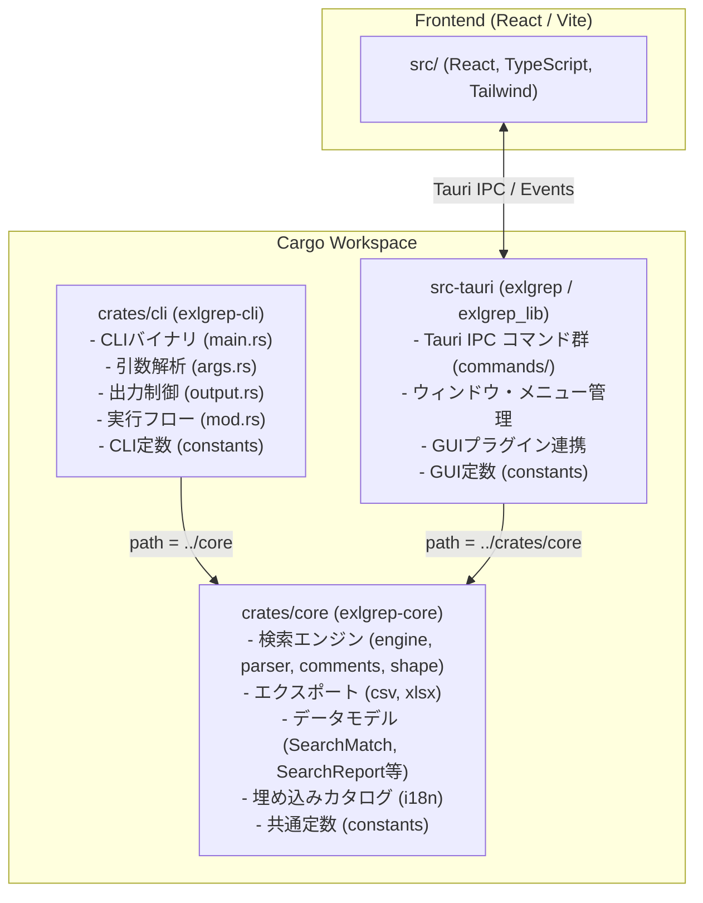

<!-- 処理内容: CLIプログラムソース分離に伴うクレート構成、モジュール境界、およびデータモデル定義を記述する。 引数・戻り値: 仕様書（spec.md）および調査結果（research.md）を入力とし、データモデル設計（Markdown文書）を出力する。 エラー: クレート間の不要な結合や循環参照を排除する設計境界を定義する。 変更履歴: v1.0.0 2026-09-29 Antigravity 初版作成。 -->
# Data Model & Crate Architecture: CLIプログラムソースの分離・独立化

**Feature Branch**: `016-extract-cli-crate`  
**Date**: 2026-09-29  
**Spec**: [spec.md](file:///F:/source/orca/workspaces/exgrep/.orca/workspaces/exgrep/copepod/specs/016-extract-cli-crate/spec.md)  
**Research**: [research.md](file:///F:/source/orca/workspaces/exgrep/.orca/workspaces/exgrep/copepod/specs/016-extract-cli-crate/research.md)

## 1. クレートアーキテクチャと依存階層



### クレート間の依存ルール (Dependency Constraints)
- **`crates/core`**: ワークスペース内の他クレートに依存してはならない（最下位基盤層）。Tauri依存を含まない。
- **`crates/cli`**: `crates/core` のみに依存する。Tauri関連クレートやGUIプラグインに一切依存しない。
- **`src-tauri`**: `crates/core` に依存する。CLIコード（`crates/cli`）には依存しない。

---

## 2. 共有データモデル (Shared Data Models in `crates/core`)

### SearchQuery (検索条件)
```rust
#[derive(Debug, Clone, Serialize, Deserialize)]
pub struct SearchQuery {
    pub keyword: String,
    pub match_case: bool,
    pub match_entire_cell: bool,
    pub use_regex: bool,
    pub search_formulas: bool,
    pub search_comments: bool,
    pub search_shapes: bool,
    pub search_hidden_sheets: bool,
    pub extensions: Vec<String>,
}
```

### SearchMatch (検索一致項目)
```rust
#[derive(Debug, Clone, Serialize, Deserialize)]
pub struct SearchMatch {
    pub id: u64,
    pub file_path: String,
    pub file_name: String,
    pub sheet_name: String,
    pub cell_coordinate: String,
    pub matched_text: String,
    pub full_cell_value: String,
    pub match_type: MatchType,
    pub row_index: u32,
    pub col_index: u32,
}
```

### SearchReport & SearchIssue (検索実行レポートと課題)
```rust
#[derive(Debug, Clone, Serialize, Deserialize)]
pub struct SearchReport {
    pub discovered_files: usize,
    pub scanned_files: usize,
    pub readable_files: usize,
    pub failed_files: usize,
    pub matches_found: usize,
    pub elapsed_ms: u64,
    pub issues: Vec<SearchIssue>,
}

#[derive(Debug, Clone, Serialize, Deserialize)]
pub struct SearchIssue {
    pub path: PathBuf,
    pub stage: String,
    pub sheet_name: Option<String>,
    pub cause: String,
}
```

---

## 3. CLI 固有データモデル (CLI Models in `crates/cli`)

### CliOptions & CliOutputTarget
```rust
pub struct CliOptions {
    pub input_paths: Vec<PathBuf>,
    pub query: SearchQuery,
    pub output_target: CliOutputTarget,
    pub format: ExportFormat,
    pub language: String,
    pub overwrite: bool,
}

pub enum CliOutputTarget {
    File(PathBuf),
    Stdout,
}

pub enum ParseOutcome {
    Run(CliOptions),
    Help(String),
}
```

---

## 4. モジュール構成詳細 (Detailed Directory Layout)

### `crates/core/`
```text
crates/core/
├── Cargo.toml
├── locales/
│   ├── ja.yml
│   └── en.yml
├── src/
│   ├── lib.rs
│   ├── constants.rs
│   ├── i18n.rs
│   ├── models/
│   │   └── mod.rs
│   ├── export/
│   │   ├── mod.rs
│   │   ├── csv_export.rs
│   │   └── xlsx_export.rs
│   └── search/
│       ├── mod.rs
│       ├── engine.rs
│       ├── parser.rs
│       ├── path.rs
│       ├── preview.rs
│       ├── comments/
│       │   ├── mod.rs
│       │   └── ooxml.rs
│       └── shape/
│           ├── mod.rs
│           ├── ooxml.rs
│           ├── xls.rs
│           └── xlsb.rs
└── tests/
    ├── shape_contract.rs
    ├── shape_export.rs
    └── shape_extract.rs
```

### `crates/cli/`
```text
crates/cli/
├── Cargo.toml
├── src/
│   ├── main.rs
│   ├── lib.rs
│   ├── constants.rs
│   ├── args.rs
│   └── output.rs
└── tests/
    ├── cli_search.rs
    └── cli_output.rs
```

### `src-tauri/` (整理後)
```text
src-tauri/
├── Cargo.toml
├── tauri.conf.json
├── capabilities/
├── icons/
├── locales/
│   ├── ja.yml
│   └── en.yml
├── src/
│   ├── main.rs
│   ├── lib.rs
│   ├── constants.rs
│   ├── i18n.rs (Tauri GUI用)
│   └── commands/
│       ├── mod.rs
│       ├── search_cmd.rs
│       ├── preview_cmd.rs
│       ├── export_cmd.rs
│       └── system_cmd.rs
└── tests/
    # CLIテストは crates/cli へ移管、コアテストは crates/core へ移管
```
