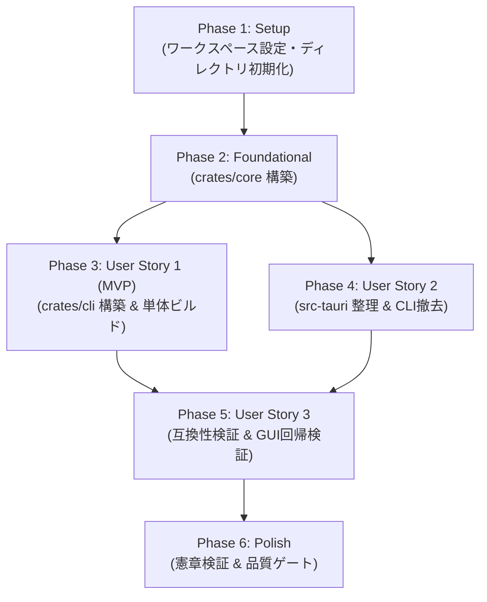

<!-- 処理内容: CLIプログラムソースのTauriディレクトリ分離機能の実装タスク一覧と依存順序を定義する。 引数・戻り値: 仕様書（spec.md）、実装計画書（plan.md）、設計書（data-model.md, contracts/）を入力とし、実行可能なタスク一覧（Markdown文書）を出力する。 エラー: タスク間の依存漏れ、ファイル競合、テスト未定義のリスクを防止する。 変更履歴: v1.0.0 2026-09-29 Antigravity 初版作成。 -->
# Tasks: CLIプログラムソースのTauriディレクトリからの分離・独立化 (Separate CLI Program Source from Tauri Directory)

**Branch**: `016-extract-cli-crate`  
**Input**: Feature specification from `specs/016-extract-cli-crate/spec.md` and design artifacts from `specs/016-extract-cli-crate/`

## Phase 1: Setup (ワークスペースとディレクトリ基盤)

**Purpose**: 3クレート構成（`crates/core`, `crates/cli`, `src-tauri`）に向けたワークスペース初期化とディレクトリ基盤の確立

- [X] T001 リポジトリルートの `Cargo.toml` を更新し、`crates/core`, `crates/cli`, `src-tauri` をワークスペースメンバーとして登録する（`Cargo.toml`）
- [X] T002 [P] 共有コアライブラリ用のディレクトリ構造および初期 `crates/core/Cargo.toml` を作成する（`crates/core/Cargo.toml`）
- [X] T003 [P] 独立CLIバイナリ用のディレクトリ構造および初期 `crates/cli/Cargo.toml` を作成する（`crates/cli/Cargo.toml`）
- [X] T004 [P] 翻訳カタログ原本（`ja.yml`, `en.yml`, `README.md`）を `crates/core/locales/` に配置する（`crates/core/locales/ja.yml`, `crates/core/locales/en.yml`, `crates/core/locales/README.md`）

---

## Phase 2: Foundational (共有コアライブラリ `crates/core` の構築)

**Purpose**: 全ユーザーストーリーの前提となる検索エンジン、エクスポート、データモデル、定数、埋め込み翻訳の共有コア基盤を構築

**⚠️ CRITICAL**: 本フェーズが完了するまで、後続のユーザーストーリー実装には進めません

- [X] T005 共通定数モジュールを `crates/core/src/constants.rs` に定義し、憲章原則II・III準拠の定数一元化と4要素ヘッダコメントを記載する（`crates/core/src/constants.rs`）
- [X] T006 [P] 共通データモデル（`SearchQuery`, `SearchMatch`, `SearchReport`, `SearchIssue`, `MatchType`, `ExportFormat` 等）を `crates/core/src/models/mod.rs` に配置する（`crates/core/src/models/mod.rs`）
- [X] T007 [P] 埋め込みYAMLカタログ読込およびキー解決機能（`load_embedded_catalogs`, `resolve_catalog_text`）を `crates/core/src/i18n.rs` に配置・実装する（`crates/core/src/i18n.rs`）
- [X] T008 検索エンジンおよびExcel解析モジュール（セル・コメント・図形内テキスト解析）を `crates/core/src/search/` に移行・配置する（`crates/core/src/search/mod.rs`, `crates/core/src/search/engine.rs`, `crates/core/src/search/parser.rs`, `crates/core/src/search/path.rs`, `crates/core/src/search/preview.rs`, `crates/core/src/search/comments/mod.rs`, `crates/core/src/search/shape/mod.rs`）
- [X] T009 エクスポートモジュール（CSV/Excel出力、汎用Writer対応 `write_csv_to_writer`）を `crates/core/src/export/` に移行・配置する（`crates/core/src/export/mod.rs`, `crates/core/src/export/csv_export.rs`, `crates/core/src/export/xlsx_export.rs`）
- [X] T010 `crates/core/src/lib.rs` で公開モジュールをエクスポートし、4要素ヘッダコメントを付与する（`crates/core/src/lib.rs`）
- [X] T011 コアの形状検索およびエクスポート統合テストを `crates/core/tests/` に配置し、`cargo test -p exlgrep-core` で検証する（`crates/core/tests/shape_contract.rs`, `crates/core/tests/shape_export.rs`, `crates/core/tests/shape_extract.rs`）

**Checkpoint**: `crates/core` がGUI/Tauriランタイムに一切依存せず単独でビルドおよび全テスト合格することを確認

---

## Phase 3: User Story 1 - 独立したCLIパッケージとしてのビルドと実行 (Priority: P1) 🎯 MVP

**Goal**: Tauriデスクトップ環境に依存せず、`crates/cli` 単体でスタンドアローンCLIツール（`exlgrep-cli`）を直接ビルド、テスト、実行できる

**Independent Test**: GUI環境のビルドを行わず `cargo build -p exlgrep-cli` および `cargo test -p exlgrep-cli` を実行し、スタンドアローンCLIバイナリが生成されて全テストが合格することを確認

### Implementation for User Story 1

- [X] T012 [P] [US1] CLI専用定数モジュールを `crates/cli/src/constants.rs` に定義し、引数名・ショートオプション・終了コード（0, 1, 2）・出力区切り文字を一元管理する（`crates/cli/src/constants.rs`）
- [X] T013 [P] [US1] コマンドライン引数解析・ショートオプション・ヘルプ生成モジュールを `crates/cli/src/args.rs` に実装する（`crates/cli/src/args.rs`）
- [X] T014 [US1] 一時ファイル保護・アトミック公開および自己上書き防止を行う出力ガードモジュールを `crates/cli/src/output.rs` に実装する（`crates/cli/src/output.rs`）
- [X] T015 [US1] 非同期パイプライン探索、Rayon並列解析、stderr即時通知、および標準出力ストリーミング制御を `crates/cli/src/lib.rs` に実装する（`crates/cli/src/lib.rs`）
- [X] T016 [US1] CLIバイナリエントリポイントを `crates/cli/src/main.rs` に実装し、`exlgrep_cli::run` を呼び出して終了ステータスを返す（`crates/cli/src/main.rs`）
- [X] T017 [US1] CLI統合テストを `crates/cli/tests/` に配置・適合させ、`cargo test -p exlgrep-cli` で全テストが合格することを検証する（`crates/cli/tests/cli_search.rs`, `crates/cli/tests/cli_output.rs`）

**Checkpoint**: `crates/cli` 単独でのビルドおよび全テストがエラー・警告ゼロで完了し、スタンドアローンCLIツールが稼働することを確認

---

## Phase 4: User Story 2 - ディレクトリ構成の明確な分離と責務の明確化 (Priority: P1)

**Goal**: `src-tauri` からCLI固有のコードや不要なバイナリ定義を完全撤去し、デスクトップGUI専用パッケージとして整理する

**Independent Test**: `src-tauri` 配下にCLI固有のファイルが存在しないことを確認し、`src-tauri` が `crates/core` を参照して正常にビルド・テストできることを確認

### Implementation for User Story 2

- [X] T018 [US2] `src-tauri/Cargo.toml` から `default-run` 設定およびCLI専用依存を整理し、`exlgrep-core` へのパス依存を追加する（`src-tauri/Cargo.toml`）
- [X] T019 [P] [US2] `src-tauri/src/bin/exlgrep-cli.rs` および `src-tauri/src/cli/` ディレクトリ（`mod.rs`, `args.rs`, `output.rs`）を `src-tauri` から完全に削除する（`src-tauri/src/bin/exlgrep-cli.rs`, `src-tauri/src/cli/`）
- [X] T020 [P] [US2] `src-tauri/tests/` 内のCLIテスト（`cli_search.rs`, `cli_output.rs`）およびコアテスト（`shape_*.rs`）を `src-tauri` から削除する（`src-tauri/tests/cli_search.rs`, `src-tauri/tests/cli_output.rs`, `src-tauri/tests/shape_*.rs`）
- [X] T021 [US2] `src-tauri/src/lib.rs` から `pub mod cli;` を削除し、各IPCコマンドハンドラ（`commands/`）が `exlgrep_core` を参照するよう更新する（`src-tauri/src/lib.rs`, `src-tauri/src/commands/`）
- [X] T022 [US2] `src-tauri/src/constants.rs` をデスクトップGUI専用定数（ウィンドウ・メニュー・IPCイベント）に整理し、コア定数は `exlgrep_core::constants` を参照する（`src-tauri/src/constants.rs`）

**Checkpoint**: `src-tauri` 内にCLI固有ファイルが残存 0 件となり、GUIバックエンドが `crates/core` と正常にリンクすることを確認

---

## Phase 5: User Story 3 - 既存CLI機能およびGUI機能の完全な互換性維持 (Priority: P1)

**Goal**: クレート分離後も従来の全CLIオプション、ショートオプション、CSV/Excel出力、終了コード仕様、およびGUI機能を完全維持する

**Independent Test**: CLIの各種引数パターン（`-h`, `-o`, `-f xlsx`, `-s` 等）およびGUIデスクトップ起動・検索が変更前と同一に動作することを検証

### Implementation for User Story 3

- [X] T023 [P] [US3] 独立CLIバイナリの全コマンドラインオプション（ロング・ショート形式、上書き保護、ヘルプ表示）の後方互換性を検証する（`crates/cli/tests/cli_output.rs`）
- [X] T024 [P] [US3] 独立CLIバイナリのExcel検索機能（セル、数式、コメント、図形内テキスト、終了コード0/1/2）の互換性を検証する（`crates/cli/tests/cli_search.rs`）
- [X] T025 [US3] `src-tauri` デスクトップGUIのビルド（`cargo build -p exlgrep`）および既存GUI単体テストがリグレッションなく成功することを検証する（`src-tauri/src/commands/`）
- [X] T026 [US3] フロントエンド型チェックおよびビルド（`npm run build`）が exit 0 で完了することを検証する（`src/`）

**Checkpoint**: CLIおよびGUIの既存機能仕様（014/015および001〜013）の全受け入れ基準が 100% 維持されていることを確認

---

## Phase 6: Polish & Cross-Cutting Concerns (品質検証とクリーンアップ)

**Purpose**: プロジェクト全体の憲章原則遵守、CI品質ゲートクリア、ドキュメント更新、およびクイックスタート検証

- [X] T027 `AGENTS.md` のディレクトリ構成記述および各モジュールの変更履歴ヘッダコメント（原則III）を更新・同期する（`AGENTS.md`）
- [X] T028 ワークスペース全体でのフォーマット検証（`cargo fmt --check`）を実行し、全コードを公式規約に適合させる（ワークスペース全体）
- [X] T029 ワークスペース全体でのClippy警告ゼロ検証（`cargo clippy --workspace --all-targets -- -D warnings`）を実行し、警告ゼロを達成する（ワークスペース全体）
- [X] T030 ワークスペース全体の全テスト実行（`cargo test --workspace`）が 0 件の失敗で完了することを検証する（ワークスペース全体）
- [X] T031 `quickstart.md` の全検証シナリオ（ヘルプ表示、標準出力CSV、ファイル出力）を実行し、動作確認を完了する（`specs/016-extract-cli-crate/quickstart.md`）

---

## Dependencies & Execution Order

### Phase Dependencies

- **Phase 1 (Setup)**: 依存関係なし。即座に開始可能。
- **Phase 2 (Foundational)**: Phase 1 完了に依存。共有コアライブラリ `crates/core` を構築し、すべての User Story をブロック。
- **Phase 3 (User Story 1 - MVP)**: Phase 2 完了に依存。`crates/core` を参照して `crates/cli` を構築。
- **Phase 4 (User Story 2)**: Phase 2 完了に依存。`src-tauri` からCLIコードを削除し、`crates/core` 参照へ切り替え（Phase 3 と並行作業可能）。
- **Phase 5 (User Story 3)**: Phase 3 および Phase 4 双方の完了に依存。CLIとGUI双方の互換性を検証。
- **Phase 6 (Polish)**: すべての User Story 完了に依存。ワークスペース全体の一括品質検証とドキュメント同期。

---

## Parallel Opportunities

- **Phase 1 (Setup)**:
  - `T002` (`crates/core` 初期化)、`T003` (`crates/cli` 初期化)、`T004` (ロケール原本配置) は並行実行可能。
- **Phase 2 (Foundational)**:
  - `T006` (モデル定義) と `T007` (i18n読込) は並行実行可能。
- **Phase 3 (User Story 1)**:
  - `T012` (CLI定数) と `T013` (引数解析) は並行実行可能。
- **Phase 4 (User Story 2)**:
  - `T019` (CLIコード削除) と `T020` (CLIテスト削除) は並行実行可能。
- **Phase 5 (User Story 3)**:
  - `T023` (CLI引数互換検証) と `T024` (CLI検索互換検証) は並行実行可能。

---

## Implementation Strategy

### MVP First (User Story 1 まで)
1. **Phase 1 (Setup)** でワークスペースとクレートディレクトリを準備
2. **Phase 2 (Foundational)** で `crates/core` を構築し、単体テストをパスさせる
3. **Phase 3 (User Story 1)** で `crates/cli` を構築し、スタンドアローンCLIバイナリを単独ビルド・実行可能にする
4. **MVP 検証**: この時点で、Tauri非依存の独立CLIツールが完成（MVP達成）

### Incremental Delivery (完全移行とGUI同期)
5. **Phase 4 (User Story 2)** で `src-tauri` から不要なコードを完全削除し、ディレクトリ分離を達成
6. **Phase 5 (User Story 3)** でCLIおよびGUIの後方互換性を包括検証
7. **Phase 6 (Polish)** で `cargo clippy`, `cargo fmt`, `npm run build` を含む全品質ゲートをクリア
