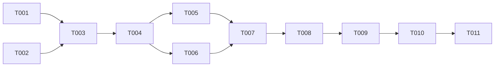

# Tasks: Bundle xlseek-cli as a Tauri Sidecar

**Input**: Design documents from `/specs/018-tauri-cli-sidecar/`

**Prerequisites**: [plan.md](./plan.md), [spec.md](./spec.md), [research.md](./research.md), [data-model.md](./data-model.md), [contracts/](./contracts/), [quickstart.md](./quickstart.md)

**Tests**: Include tests for build helper logic and CLI regressions. Constitution Principle V requires tests for new and changed modules.

**Organization**: Tasks are grouped by the P1 user story.

## Format: `[ID] [P?] [Story] Description`

- **[P]**: Tasks that modify different files and have no dependency on an incomplete task can run in parallel.
- **[Story]**: Identifies the user story. Setup, foundational, and finalization tasks do not use a story marker.
- Each task description includes a target file path.

## Phase 1: Setup

**Purpose**: Prepare a command for running helper tests and ignore generated artifacts.

- [X] T001 [P] Add `test:build-cli` to `package.json` to run `node --test scripts/build-cli.test.js`.
- [X] T002 [P] Add `src-tauri/binaries/` to `.gitignore` so generated Sidecar executables are excluded from source control.

---

## Phase 2: Foundational

**Purpose**: Centralize names and configuration values shared by the build helpers.

- [X] T003 Create `scripts/build-constants.js` and export constants for the CLI package/binary names, Tauri target environment variable, Sidecar base path, and generated binaries directory. Document the module's purpose, inputs/outputs, and error behavior in its file header; do not add change history.

**Checkpoint**: The helper test command and shared build constants are ready for the user story implementation.

---

## Phase 3: User Story 1 - Distribute the desktop application and CLI together (Priority: P1) 🎯 MVP

**Goal**: Include an `xlseek-cli` built for the corresponding target in supported Tauri distributions so users can launch it directly after installation.

**Independent Test**: Inspect Windows x64, macOS Intel x64, macOS Apple Silicon arm64, and Linux x64 GNU distributions. Verify that each contains a target-matched CLI and that the installed executable displays help and runs an existing search.

### Tests for User Story 1

- [X] T004 [US1] Add tests to `scripts/build-cli.test.js` for target environment priority and host fallback, the Windows `.exe` suffix, Sidecar names and paths, empty/invalid target errors, and a missing source artifact. Document inputs, outputs, and failure behavior in the test file and each test helper.

### Implementation for User Story 1

- [X] T005 [US1] Implement pure functions in `scripts/build-cli-utils.js` to resolve the target triple and derive OS-specific executable names, Cargo output paths, and Tauri Sidecar staging paths. Reference constants from `scripts/build-constants.js`. Document processing, arguments, return values, and error conditions in file/function comments.
- [X] T006 [P] [US1] Declare `binaries/xlseek-cli` under `bundle.externalBin` in `src-tauri/tauri.conf.json` so the Tauri bundler includes target-suffixed Sidecar files.
- [X] T007 [US1] Update `scripts/build-cli.js` to use the Tauri target triple (or the host triple when run standalone), build `xlseek-cli` in release mode for that target, and stage the artifact as `src-tauri/binaries/xlseek-cli-<target-triple>[.exe]`. Cargo failures, target mismatches, missing artifacts, and staging failures must exit nonzero and report the target and expected paths. Preserve constant-reference comments and the header describing processing, arguments, return values, and error conditions.
- [X] T008 [US1] Run the tests in `scripts/build-cli.test.js` through `npm run test:build-cli` and pass the existing CLI regression tests with `cargo test -p xlseek-cli`.
- [ ] T009 [US1] Follow `specs/018-tauri-cli-sidecar/quickstart.md` to verify that Windows x64, macOS Intel x64, macOS Apple Silicon arm64, and Linux x64 GNU Tauri distributions each contain a target-matched CLI that can display help and search/export results from the installation location.
- [X] T010 [US1] Document the `xlseek-cli` locations verified from each OS distribution and direct invocation examples in `README.md` and `README_ja.md`, clarifying when separate installation or `PATH` registration is unnecessary.

**Checkpoint**: Each of the four target distributions contains its matching CLI, and standalone launch and existing search/export behavior are verified.

---

## Phase 4: Polish & Cross-Cutting Concerns

**Purpose**: Verify workspace quality and cross-cutting regressions.

- [X] T011 Based on `specs/018-tauri-cli-sidecar/quickstart.md` and `specs/018-tauri-cli-sidecar/plan.md`, run `npm run build`, `cargo test --workspace`, `cargo clippy --workspace --all-targets -- -D warnings`, and `cargo fmt --check`; confirm all existing GUI and CLI quality gates succeed.

---

## Dependencies & Execution Order

### Phase Dependencies

- **Setup (Phase 1)**: T001 and T002 modify separate files and can run in parallel.
- **Foundational (Phase 2)**: Complete T003 after Setup and before implementing the user story.
- **User Story 1 (Phase 3)**: Depends on Setup and Foundational. After T004 adds tests, T005's helper module and T006's Tauri bundle configuration can run in parallel because they modify separate files. T007 depends on both. Run T008 and T009 after build integration. T010 follows T009 so documentation can use observed package locations.
- **Polish (Phase 4)**: T011 follows implementation, tests, distribution inspection, and documentation.

### User Story Dependencies

- **User Story 1 (P1)**: Has no dependency on another user story. It is the full scope of this feature and forms its MVP.

### Dependency Graph



### Parallel Opportunities

- Setup: **T001** (`package.json`) and **T002** (`.gitignore`).
- User Story 1: **T005** (`scripts/build-cli-utils.js`) and **T006** (`src-tauri/tauri.conf.json`) can run in parallel after T004.
- There are no other user stories to run in parallel.

---

## Parallel Example: User Story 1

```text
Prerequisite: T001, T002, T003, and T004 are complete.
Parallel tasks:
- T005: implement target/path helpers in scripts/build-cli-utils.js
- T006: add bundle.externalBin to src-tauri/tauri.conf.json
Next:
- T007: use the helpers in scripts/build-cli.js to build and stage the CLI
```

---

## Implementation Strategy

### MVP First (User Story 1 Only)

1. Complete Setup and Foundational tasks so the Node helper tests can run.
2. Write the US1 tests first to verify target resolution, filenames, and error cases.
3. Declare the Sidecar and implement target-aware build/staging.
4. Run unit tests and existing CLI regression tests.
5. Inspect all four target distributions and launch the CLI from each installed location.
6. Update the READMEs to match observed package locations and run workspace quality gates.

### Incremental Delivery

- **MVP**: T001–T010 establish the P1 story across all four target configurations. Do not treat one target as completion; inspect each package and verify standalone launch.
- **Final verification**: Run all workspace quality gates in T011.

## Format Validation

- Every task starts with `- [ ] Tnnn` and task IDs are sequential.
- Only parallelizable tasks have `[P]`; user story tasks use `[US1]`.
- Each task description includes a target file or quickstart path.
- No sample entries or unresolved template placeholders remain.
